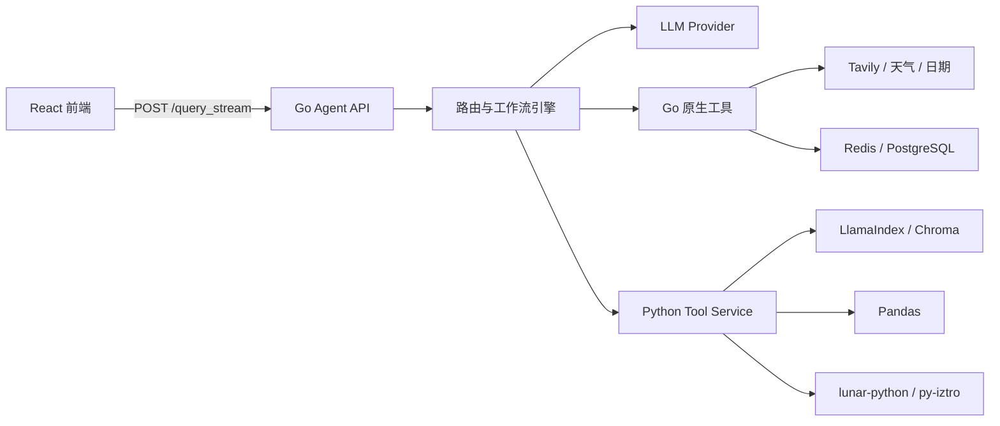
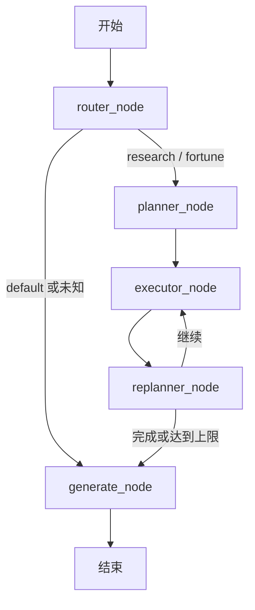
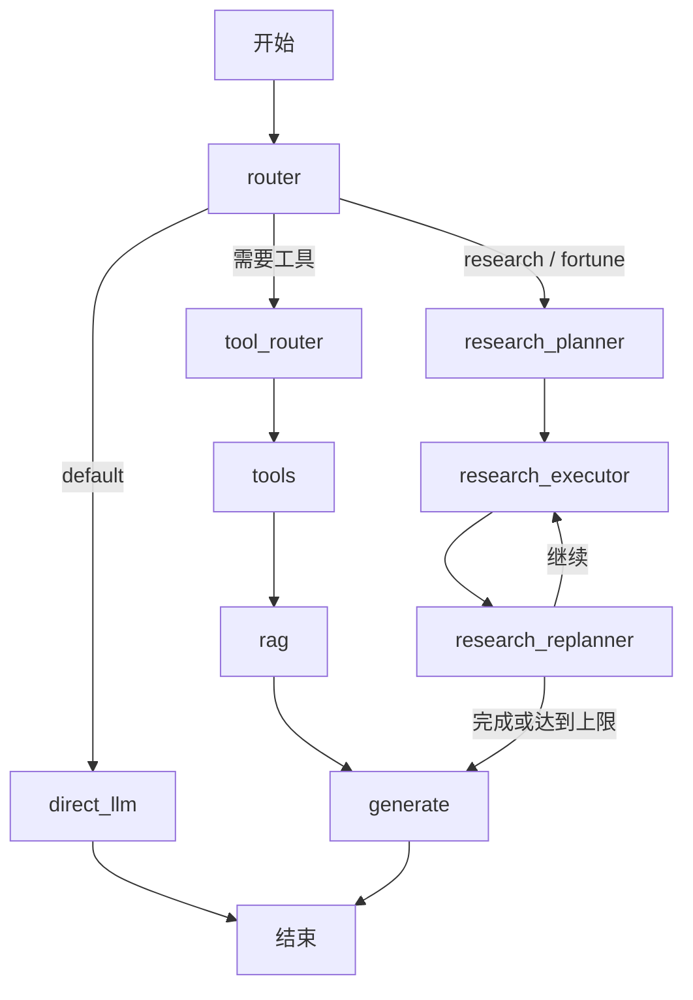
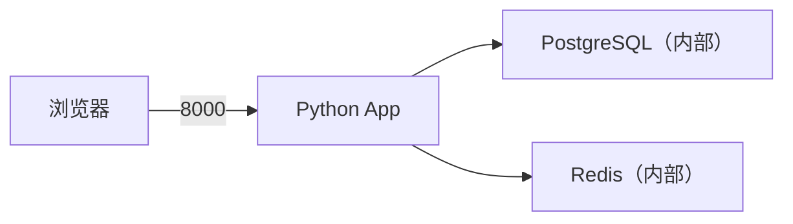
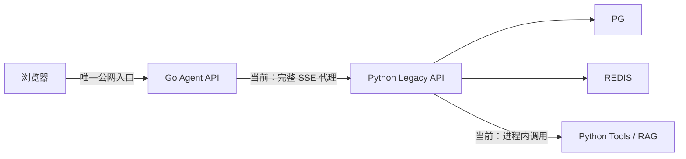

# 奇点 AI Agent：Python 迁移 Go 设计与实施文档

> 文档状态：修订版；完成 Gate 0 安全门禁后方可拆分迁移开发任务
> 适用仓库：`qidianAgent`
> 迁移范围：后端服务；前端 React/Vite 原则上不改
> 核心策略：接口兼容、渐进迁移、双栈共存、可灰度、可回滚

---

## 1. 迁移结论

本项目不适合直接进行“一次性全量 Go 重写”。

推荐方案是：

1. 使用 Go 接管 HTTP API、SSE 流式响应、Agent 路由、工作流状态机、模型调用、网络搜索、缓存、数据库和可观测性。
2. Python 暂时保留本地文档 RAG、Pandas 数据分析、农历排盘、紫微斗数等依赖 Python 生态的能力。
3. Go 与 Python 通过内部 HTTP/gRPC 接口通信，工具层统一抽象，业务工作流不感知工具实际运行在哪种语言中。
4. 保持前端 `/query_stream` 请求格式和 SSE 事件格式兼容，迁移期间前端无需跟随改造。
5. 每迁移一层，都保留切回 Python 的开关；通过影子流量和结果对比验证后再正式切流。

迁移完成后的目标形态：



---

## 2. 当前系统架构

### 2.1 总体调用链

当前唯一公网流式入口的实际调用链如下：

```text
React 页面
  -> frontend/src/lib/api.ts
  -> POST /query_stream
  -> backend/app/main.py
  -> backend/app/api/graph_routes.py
  -> backend/graph/__init__.py::stream_graph（手写流式编排）
  -> router_node
  -> default: generate_node
  -> research/fortune: planner -> executor -> replanner -> generate
  -> SSE delta/done/error
  -> React 增量渲染
```

公网 `/query_stream` **不调用** `build_graph()` 编译出的 LangGraph，也不经过
`direct_llm_node`。`builder.py`、`direct_llm_node`、`tool_router_node`、
`tools_node` 和它们注册的条件边属于同步兼容路径或遗留设计，不能作为 Go
迁移的现网行为基线。

当前系统可以划分为五层：

| 层级 | 当前实现 | 主要职责 |
|---|---|---|
| 前端交互层 | React、Vite、TypeScript | 会话输入、模式选择、SSE 读取、Markdown 展示 |
| API 层 | FastAPI、sse-starlette | 参数校验、接口暴露、流式响应 |
| 编排层 | LangGraph、自定义节点 | 路由、计划、执行、重规划、生成 |
| Agent/工具层 | LangChain、自定义 Python 工具 | 搜索、天气、日期、命理排盘、知识库查询 |
| 数据与模型层 | DashScope、Tavily、Redis、PostgreSQL、Chroma | 模型推理、外部搜索、缓存、关系数据、向量检索 |

### 2.2 现有 Agent

`backend/configs/agents.yaml` 声明了四类 Agent，但当前公网流式入口没有按照
YAML 创建并执行四个独立 Agent。请求名称先转换为 `mode_hint`，再由意图
分类器决定路由，最后只剩 `default`、`research`、`fortune` 三种运行路径。

#### 公网请求基线矩阵

| 请求中的 `agent_name` | Handler 转换 | Router 可能结果 | 实际节点 | 实际生成 Prompt |
|---|---|---|---|---|
| 空值/未传 | `mode_hint=None` | `default` / `research` / `fortune` | 取决于自动分类 | 按最终 route 选择 |
| `default_llm_agent` | 当前未显式识别，按 auto 处理 | 三种 route 均可能 | 不保证 default | 按最终 route 选择 |
| `research_agent` / `research` | `mode_hint=research` | `default` 或 `research` | default 直接 generate；research 走计划循环 | default/research |
| `fortune_agent` / `fortune` | `mode_hint=fortune` | `default` 或 `fortune` | default 直接 generate；fortune 走计划循环 | default/fortune |
| `general_rag_agent` | 当前未显式识别，按 auto 处理 | 三种 route 均可能 | 不保证进入 research | 按最终 route 选择 |

意图路由器内部如果返回 `general_rag_agent`，`router_node` 会把它折叠为
`research`。因此“请求指定 `general_rag_agent`”与“分类器返回
`general_rag_agent`”不是同一种行为。

#### 实际工具基线

research/fortune 共用 `executor_node`。当前真正存在执行分支的是：

- `get_lunar_chart`
- `get_ziwei_chart`
- Tavily 搜索
- `none`/其他名称的逻辑记录

日期、天气虽然出现在工具说明和部分映射代码中，但当前 Executor 没有对应
执行分支；本地 KB、Pandas 和 `deep_research` 也未进入公网流式执行链。
迁移基线必须复现这个现状，新增工具能力作为独立功能变更验收。

### 2.3 当前工作流

系统中同时存在两套编排语义。

#### A. 公网 `/query_stream` 实际流程



#### B. 编译图/兼容流程



该流程由 `builder.py` 描述，但不是公网流式入口的当前执行路径。迁移阶段 2
不得以它的 `default -> direct_llm` 作为兼容目标。

此外，`backend/graph/nodes/rag.py` 中的 RAG 节点处于全局暂停状态。因此，
现阶段研究和命理结果主要依赖 Executor 写入的上下文，而不是完整 RAG
链路。迁移期间保持该状态；启用 RAG 必须作为独立功能变更。

### 2.4 当前 GraphState

当前状态包含以下信息：

- 用户输入和聊天历史；
- 模式提示、强制路由和实际路由；
- 检索文档和格式化上下文；
- 工具执行结果；
- 计划任务、完成项、当前项、执行笔记；
- 迭代次数和最大迭代次数；
- 最终答案、兼容输出字段；
- 元数据、中间步骤和错误信息。

Go 迁移时应保留这些语义，但不需要完全复制 Python/LangGraph 的内部数据格式。

### 2.5 当前 Prompt 基线

实际运行 Prompt 的唯一来源为 `backend/agent/prompts/`，相对路径统一以
`backend/` 为基准。Python 通过 `agent.prompts.loader` 加载，并可计算
SHA-256 内容哈希。

公网流式链使用：

- `intent_classification.txt`
- `planner_research.txt` / `planner_fortune.txt`
- `executor_tool_selection.txt`
- `executor_birth_extract.txt`
- `replanner.txt`
- `generate_default_system.txt` / `generate_research_system.txt` /
  `generate_fortune_system.txt`

`general_prompt.txt`、`fortune_general_prompt.txt` 和 `direct_llm_system.txt`
不属于公网默认流。Go 对比测试必须同时记录 Prompt 路径和 SHA-256；哈希
不一致时，不进行回答质量对比。

---

## 3. 迁移目标与非目标

### 3.1 目标

- 在不修改前端主要调用逻辑的前提下替换后端入口。
- 保持 `/query_stream` 请求和 SSE 响应兼容。
- 将 Agent 编排变成显式、可测试、可观测的 Go 状态机。
- 降低运行时内存、启动时间和部署复杂度。
- 为请求超时、并发控制、取消传播、重试和熔断建立统一机制。
- 把 Python 能力收敛为边界清晰的内部工具服务。
- 支持单 Agent、单工具、单用户或按比例灰度。
- 支持快速回滚到原 Python 服务。

### 3.2 非目标

第一阶段不做以下工作：

- 不重写 React 前端。
- 不立即替换 Chroma 或重建全部向量数据。
- 不立即用 Go 重写 PDF/Word/Excel 文档解析。
- 不立即用 Go 重写 Pandas 查询能力。
- 不立即用 Go 复刻 `lunar-python` 和 `py-iztro`。
- 不在迁移过程中重新设计 Prompt 或调整回答风格。
- 不同时改数据库结构和 Agent 业务规则。

这些工作如果和语言迁移同时发生，会使结果差异无法定位。

---

## 4. 目标技术架构

### 4.1 服务划分

建议迁移后保留两个后端服务：

#### Go Agent API

职责：

- 对外提供 HTTP API；
- 参数校验与身份认证；
- SSE 流管理；
- Agent 配置加载；
- 意图识别和模式路由；
- Planner/Executor/Replanner/Generate 编排；
- LLM 流式调用；
- Go 原生工具执行；
- Redis/PostgreSQL 访问；
- 日志、指标、链路追踪；
- 限流、超时、重试、熔断和优雅停机。

#### Python Tool Service

职责：

- 本地文件加载、切分、向量化和检索；
- Chroma 访问；
- LlamaIndex 查询；
- Pandas 数据分析；
- 农历和八字排盘；
- 紫微斗数排盘；
- 迁移期尚未 Go 化的其他工具。

Python Tool Service 只提供内部接口，不再直接承担公网入口。

### 4.2 推荐 Go 工程结构

建议在仓库根目录新增 `go-backend`：

```text
go-backend/
├── cmd/
│   └── server/
│       └── main.go
├── internal/
│   ├── api/
│   │   ├── handler/
│   │   ├── middleware/
│   │   ├── request/
│   │   ├── response/
│   │   └── sse/
│   ├── agent/
│   │   ├── config/
│   │   ├── router/
│   │   ├── planner/
│   │   ├── executor/
│   │   ├── replanner/
│   │   └── generator/
│   ├── workflow/
│   │   ├── engine.go
│   │   ├── state.go
│   │   ├── event.go
│   │   └── node.go
│   ├── llm/
│   │   ├── client.go
│   │   ├── dashscope/
│   │   └── mock/
│   ├── tool/
│   │   ├── registry.go
│   │   ├── native/
│   │   └── python/
│   ├── repository/
│   │   ├── redis/
│   │   └── postgres/
│   ├── observability/
│   └── platform/
├── pkg/
│   └── protocol/
├── test/
│   ├── contract/
│   ├── integration/
│   └── fixtures/
├── go.mod
├── go.sum
└── Dockerfile
```

迁移期不复制出第二份 `agents.yaml` 或 Prompt。Go 通过构建上下文读取仓库中
同一份 `backend/configs/agents.yaml` 和 `backend/agent/prompts/`，并在启动
时验证 Prompt SHA-256。只有未来拆仓库时，才将这些文件提升为带版本号的
独立契约包。

原则：

- `internal/api` 只处理协议，不放 Agent 业务逻辑；
- `internal/workflow` 不直接依赖具体 LLM 或工具实现；
- `internal/agent` 实现业务节点；
- `internal/tool` 通过统一注册表屏蔽 Go/Python 差异；
- `pkg/protocol` 只存放稳定、可复用的协议模型；
- 外部依赖都通过接口注入，方便单元测试。

### 4.3 迁移期部署拓扑基线

阶段 0 修复后的当前 Python 拓扑：



- 生产 Compose 只发布应用端口；
- PostgreSQL 和 Redis 仅在 Compose 内部网络暴露；
- Python 启动入口固定为 `app.main:app`；
- `/healthz` 用于容器健康检查；
- 所有 Secret 由运行环境注入。

阶段 1 增加 Go 后的拓扑：



这一阶段 Go 不直接调用 Tool。它把完整请求代理给 Python，Python 的
`stream_graph` 仍在进程内调用现有工具。阶段 2 起迁移默认 Agent，阶段 4
才增加独立 Python Tool Service；两者不能混为当前已实现架构。

约束：

- Go 是唯一公网入口；
- Python Legacy API 和 Tool Service 不发布宿主机端口；
- 灰度和回滚只改变 Go/网关路由，不迁移或复制在线数据；
- 健康检查必须区分“进程存活”和“可接受请求”；
- 回滚路径为 Go 将请求重新代理给 Python，或入口权重切回 Python；
- 开发环境可以显式发布数据库端口，生产环境不允许。

---

## 5. Python 与 Go 模块映射

| Python 模块 | 当前职责 | Go 目标模块 | 迁移方式 |
|---|---|---|---|
| `backend/app/main.py` | FastAPI 入口、路由、生命周期 | `cmd/server`、`internal/api` | Go 重写 |
| `backend/app/api/graph_routes.py` | SSE 接口、Graph 调用 | `internal/api/handler`、`internal/api/sse` | Go 重写并保持协议 |
| `backend/app/api/intent_router.py` | 意图分类和 Agent 路由 | `internal/agent/router` | Go 重写 |
| `backend/app/api/agent_factory.py` | 兼容执行器工厂，公网流未直接使用缓存 | `internal/agent/config`、工厂 | 仅迁移仍生效语义 |
| `backend/configs/agents.yaml` | Agent 声明；部分字段当前不控制公网流 | Go 从同一文件加载 | 不复制，逐字段验证是否生效 |
| `backend/graph/__init__.py::stream_graph` | 公网实际手写编排 | `internal/workflow/engine.go` | 第一优先级迁移基线 |
| `backend/graph/state.py` | GraphState | `internal/workflow/state.go` | Go 结构体 |
| `backend/graph/builder.py` | 同步兼容/遗留图结构 | 不直接映射 | 完成调用审计后保留或删除 |
| `backend/graph/nodes/router.py` | 路由节点 | `internal/agent/router` | Go 重写 |
| `backend/graph/nodes/direct_llm.py` | 编译图默认节点，公网流不经过 | 兼容模块 | 不作为阶段 2 基线 |
| `backend/graph/nodes/planner.py` | 任务规划 | `internal/agent/planner` | Go 重写 |
| `backend/graph/nodes/executor.py` | 工具选择与执行 | `internal/agent/executor` | Go 重写 |
| `backend/graph/nodes/replanner.py` | 判断继续或结束 | `internal/agent/replanner` | Go 重写 |
| `backend/graph/nodes/generate.py` | 最终答案生成 | `internal/agent/generator` | Go 重写 |
| `backend/graph/nodes/tools_exec.py` | 工具调度 | `internal/tool/registry.go` | Go 重写 |
| `backend/agent/tools/deep_research.py` | Tavily/LLM 调研 | `internal/tool/native/search` | Go 重写 |
| `backend/agent/tools/weather.py` | 天气查询 | `internal/tool/native/weather` | Go 重写 |
| `backend/agent/tools/date.py` | 日期工具 | `internal/tool/native/date` | Go 重写 |
| `backend/infra/cache/redis_client.py` | Redis | `internal/repository/redis` | Go 重写 |
| `backend/infra/db/connection.py` | PostgreSQL | `internal/repository/postgres` | Go 重写 |
| `backend/rag/**` | 文档、向量、Pandas RAG | Python Tool Service | 暂不重写 |
| `backend/agent/tools/local_kb.py` | 本地知识库工具 | Python Tool Service | 封装接口 |
| `backend/agent/tools/pandas_kb.py` | CSV/Pandas 查询 | Python Tool Service | 封装接口 |
| `backend/agent/tools/lunar_chart.py` | 农历、八字 | Python Tool Service | 封装接口 |
| `backend/agent/tools/ziwei_chart.py` | 紫微斗数 | Python Tool Service | 封装接口 |
| `backend/agent/prompts/**` | 实际 Prompt 唯一来源及遗留模板 | Go 读取同一文件并校验 hash | 不复制、不改写 |

---

## 6. 对外协议兼容

### 6.1 请求协议

迁移后继续支持：

```http
POST /query_stream
Content-Type: application/json
Accept: text/event-stream
```

请求体：

```json
{
  "query": "用户问题",
  "agent_name": "research_agent",
  "chat_history": [
    {
      "role": "user",
      "content": "上一轮问题"
    },
    {
      "role": "assistant",
      "content": "上一轮回答"
    }
  ]
}
```

兼容规则：

- `query` 必填，去除空白后不能为空；
- `agent_name` 可空，为空时自动路由；
- 支持现有别名：`research`、`fortune`；
- `chat_history` 可空；
- 未知字段第一阶段忽略，便于平滑升级；
- 请求体大小必须配置上限；
- 客户端断开后，Go 原生模型和工具调用必须通过 `context.Context` 取消；
  阶段 1 对 Python Legacy 仅保证关闭代理 HTTP 连接，阶段 4 才保证执行级取消。

### 6.2 SSE 响应协议

现有前端按行读取 `data:`，因此 Go 必须输出：

```text
event: message
data: {"type":"delta","data":"文本","isThinking":false,"thinkingFinished":true}

```

事件类型：

#### 思考进度

```json
{
  "type": "delta",
  "data": "Step1: 搜集相关资料\n",
  "isThinking": true,
  "thinkingFinished": false
}
```

这里输出的是计划或执行进度，不应输出模型的隐式思维链。

#### 答案增量

```json
{
  "type": "delta",
  "data": "答案片段",
  "isThinking": false,
  "thinkingFinished": true
}
```

#### 完成

```json
{
  "type": "done"
}
```

#### 失败

```json
{
  "type": "error",
  "message": "处理失败"
}
```

### 6.3 SSE 实现要求

- 响应头必须包含 `Content-Type: text/event-stream`；
- 设置 `Cache-Control: no-cache`；
- 设置 `X-Accel-Buffering: no`，避免 Nginx 缓冲；
- 每条事件以空行结束；
- 每次写入后调用 Flush；
- 长时间无内容时发送注释心跳，如 `: ping\n\n`；
- 不在 error 事件中暴露 API Key、内部地址、堆栈或完整上游响应；
- 服务端必须区分“请求已取消”和“系统执行失败”；
- 记录首包耗时、总耗时、delta 数、输出字符数和取消原因。

### 6.4 协议版本

建议新增可选响应头：

```text
X-Agent-Protocol-Version: 1
```

第一阶段不改变 JSON 内容。后续新增事件字段时遵循只增不删，前端忽略未知字段。

---

## 7. Go 核心模型设计

### 7.1 GraphState

建议将状态定义为普通 Go 结构体：

```go
type Message struct {
    Role    string `json:"role"`
    Content string `json:"content"`
}

type PromptVersion struct {
    Stage          string `json:"stage"`
    Path           string `json:"path"`
    SHA256         string `json:"sha256"`
    RenderedSHA256 string `json:"rendered_sha256,omitempty"`
    Iteration      *int   `json:"iteration,omitempty"`
}

type GraphState struct {
    Query       string
    ChatHistory []Message
    ModeHint    string

    Route      string
    ForceRoute string

    ContextDocs []string
    Context     string
    ToolResults map[string]any

    PlanTasks         []string
    PlanCompleted     []string
    PlanCurrent       string
    PlanNotes         []string
    PlanDone          bool
    PlanIteration     int
    PlanMaxIterations int

    FinalAnswer string
    Output      string

    PromptVersions   []PromptVersion
    Metadata          map[string]any
    IntermediateSteps []Step
    Err               error
}
```

迁移原则：

- 状态只存业务数据，不持有网络连接、数据库连接或全局客户端；
- 不在多个 goroutine 中无保护地修改同一个 State；
- 单个请求默认串行推进状态；
- 并行工具执行时先分别返回结果，再由执行器统一合并；
- 错误使用 Go `error` 传递，对外响应时再映射成安全错误码和消息。

### 7.2 工作流节点

```go
type Node interface {
    Name() string
    Run(ctx context.Context, state GraphState, emit Emitter) (GraphState, error)
}

type Emitter interface {
    Progress(ctx context.Context, text string) error
    Delta(ctx context.Context, text string) error
}
```

节点不应直接写 HTTP Response。节点只调用 `Emitter`，SSE Handler 负责把内部事件转换成对外协议。

### 7.3 工作流引擎

项目当前图结构固定、节点数少，第一阶段不需要为了替代 LangGraph 而引入复杂 Go 图框架。建议实现显式状态机：

```go
func (e *Engine) Run(ctx context.Context, state GraphState, emit Emitter) error {
    state, err := e.router.Run(ctx, state, emit)
    if err != nil {
        return err
    }

    switch state.Route {
    case "research", "fortune":
        state, err = e.planner.Run(ctx, state, emit)
        if err != nil {
            return err
        }

        for !state.PlanDone {
            if state.PlanIteration >= state.PlanMaxIterations {
                break
            }
            state, err = e.executor.Run(ctx, state, emit)
            if err != nil {
                return err
            }
            state, err = e.replanner.Run(ctx, state, emit)
            if err != nil {
                return err
            }
        }

        _, err = e.generator.Run(ctx, state, emit)
        return err

    case "default":
        _, err = e.generator.Run(ctx, state, emit)
        return err

    default:
        // 保持公网 stream_graph 的现有兜底语义：
        // 未知路由按 default 处理并进入 generator。
        state.Route = "default"
        _, err = e.generator.Run(ctx, state, emit)
        return err
    }
}
```

`direct_llm` 不属于公网 Engine 主流程，只作为编译图/同步兼容路径单独保留；
不得用它实现公网 `route=default`。

显式状态机的优势：

- 流转规则可直接阅读；
- 更容易做超时、取消和最大迭代控制；
- 单元测试不依赖第三方图框架；
- 每个节点都可单独替换或灰度；
- 与当前固定业务流程匹配。

如果未来工作流需要运行时动态配置、持久化暂停、人工审批或跨天恢复，再评估 Temporal 等工作流基础设施。

---

## 8. LLM 层设计

### 8.1 统一接口

```go
type ChatRequest struct {
    Model       string
    Messages    []Message
    Temperature float64
    Stream      bool
}

type ChatChunk struct {
    Content      string
    FinishReason string
}

type Client interface {
    Complete(ctx context.Context, req ChatRequest) (string, error)
    Stream(ctx context.Context, req ChatRequest) (<-chan ChatChunk, <-chan error)
}
```

不要让 Agent 节点直接拼接厂商 HTTP 请求。DashScope 适配器负责：

- 请求和响应模型映射；
- API Key 注入；
- HTTP 超时；
- 状态码分类；
- 流式帧解析；
- 重试；
- 指标；
- 敏感信息过滤。

### 8.2 超时与重试

建议默认值：

| 调用类型 | 建议超时 | 重试 |
|---|---:|---:|
| 意图分类 | 10–20 秒 | 最多 1 次 |
| Planner | 30–60 秒 | 最多 1 次 |
| 单次工具调用 | 10–60 秒 | 按工具配置 |
| Replanner | 20–40 秒 | 最多 1 次 |
| 最终生成 | 60–180 秒 | 流式开始后不自动重放 |
| Python RAG | 60–180 秒 | 仅幂等查询可重试 |

重试只适用于：

- 连接建立失败；
- 临时 DNS/网络错误；
- HTTP 429；
- 明确的 5xx；
- 尚未向前端输出任何答案增量的请求。

一旦已经向前端发送答案 delta，不应在后台静默重跑整次生成，否则可能输出重复内容。

---

## 9. 工具体系设计

### 9.1 统一工具接口

```go
type ToolDefinition struct {
    Name             string
    Description      string
    InputSchema      json.RawMessage
    Effect           string // read / write / destructive
    Idempotent       bool
    IdempotencyKey   bool
    ShadowAllowed    bool
    Timeout          time.Duration
    MaxInputBytes    int64
    MaxOutputBytes   int64
    ConcurrencyClass string
}

type ToolResult struct {
    Content  string
    Metadata map[string]any
}

type Tool interface {
    Definition() ToolDefinition
    Execute(ctx context.Context, input json.RawMessage) (ToolResult, error)
}
```

所有工具都注册到同一个 Registry：

```go
type Registry interface {
    Register(tool Tool) error
    Get(name string) (Tool, bool)
    List() []ToolDefinition
}
```

对于工作流来说，Go 原生工具和 Python 远程工具具有相同接口。

注册时执行强校验：

- `destructive` 工具必须设置 `ShadowAllowed=false`；
- 非幂等写工具必须拒绝自动重试；
- 需要幂等键的工具缺少 Key 时拒绝执行；
- 输入、输出、超时和并发类别必须有有限值；
- 影子请求只能调用 `Effect=read && ShadowAllowed=true` 的工具。

不能仅根据工具名称判断副作用。例如 `query_local_kb` 在服务尚未初始化时
可能隐式构建索引，因此只有显式进入只读、已初始化模式后才允许影子调用；
`init_local_rag(force=true)` 属于 destructive，始终禁止影子执行。

### 9.2 第一批 Go 原生工具

建议优先迁移：

- 当前日期；
- Tavily 搜索；
- 天气查询；
- 纯 HTTP 数据源；
- Redis 缓存；
- PostgreSQL 查询；
- 不依赖 Python 科学计算生态的格式化工具。

这些工具协议明确，Go 实现成本低，也容易通过固定输入输出做回归测试。

### 9.3 暂留 Python 的工具

以下能力先保留：

- `query_local_kb`
- `init_local_rag`
- `query_pandas_data`
- `init_pandas_rag`
- `get_lunar_chart`
- `get_ziwei_chart`
- 命理 RAG

原因：

- 当前直接依赖 LlamaIndex、Chroma 和 Unstructured；
- Pandas 查询引擎包含 Python 数据处理逻辑；
- 农历和紫微工具依赖已有 Python 库；
- 直接 Go 化的业务验证成本大于性能收益；
- 这些工具不是 API/SSE 并发瓶颈的主要来源。

---

## 10. Python Tool Service 协议

### 10.1 推荐接口

初期使用内部 HTTP/JSON 即可，便于快速落地和调试。流量或性能需要时再切换 gRPC。

#### 健康检查

```http
GET /internal/health
```

#### 列出工具

```http
GET /internal/v1/tools
```

#### 创建执行

```http
POST /internal/v1/executions
Content-Type: application/json
X-Request-ID: ...
```

请求：

```json
{
  "execution_id": "exec_xxx",
  "tool_name": "query_local_kb",
  "arguments": {
    "question": "查询内容"
  },
  "context": {
    "request_id": "req_xxx",
    "agent_name": "general_rag_agent",
    "deadline_ms": 60000,
    "shadow": false,
    "idempotency_key": "optional-key"
  }
}
```

创建成功返回：

```json
{
  "execution_id": "exec_xxx",
  "status": "queued"
}
```

响应状态码为 `202 Accepted`。`execution_id` 由 Go 在发起请求前生成，避免
Go 连接断开后无法定位任务。

#### 查询执行

```http
GET /internal/v1/executions/{execution_id}
```

状态机：

```text
queued -> running -> succeeded
                  -> failed
                  -> cancel_requested -> cancelled
                  -> timed_out
```

成功结果：

```json
{
  "execution_id": "exec_xxx",
  "status": "succeeded",
  "data": {
    "content": "工具结果",
    "metadata": {
      "source": "local_kb"
    }
  }
}
```

失败结果：

```json
{
  "execution_id": "exec_xxx",
  "status": "failed",
  "error": {
    "code": "TOOL_EXECUTION_FAILED",
    "message": "工具执行失败",
    "retryable": false
  }
}
```

#### 取消执行

```http
DELETE /internal/v1/executions/{execution_id}
```

取消规则：

1. Go 客户端断开后立即发送取消请求；
2. Python 服务同时执行自己的硬截止时间，不能只信任 Go 的
   `deadline_ms`；
3. asyncio 原生任务使用协作式取消；
4. Pandas、Chroma、同步 HTTP 和无法响应协作式取消的任务放入独立 Worker
   进程；
5. 达到取消宽限期后终止 Worker 进程，不使用不可终止的线程承载长任务；
6. 写任务必须用幂等键或事务处理进程中止后的重试；
7. `cancel_requested` 不等于已取消，只有 Worker 停止后才能标记
   `cancelled`。

### 10.2 安全与执行约束

- 只监听容器内部网络或内网地址；
- 不对公网暴露；
- Go 和 Python 服务间使用服务凭据或 mTLS；
- 每个请求设置最大 body；
- 对文件路径做白名单限制；
- 禁止从请求中接收任意 Python 代码、SQL 或系统命令并直接执行；
- 日志中不记录原始密钥和完整敏感文档；
- Python 服务必须执行超时和并发上限；
- 每次执行都要检查工具副作用元数据；
- 影子请求在注册表和 Python 服务两层强制拒绝非只读工具；
- Go 取消请求后必须发出取消指令并跟踪最终状态；
- 不可取消任务必须隔离到可终止 Worker，不能仅记录超时后继续后台运行。

---

## 11. 配置迁移

### 11.1 配置优先级

建议统一为：

```text
环境变量 > 配置文件 > 程序默认值
```

### 11.2 Agent 配置

第一阶段保留 `agents.yaml`，但不能假定所有字段当前都已生效。先为每个字段
标注 `effective`、`declared_only` 或 `legacy`，再决定 Go 是否实现。

- `name`
- `description`
- `is_default`
- `llm`
- `mode`
- `tools`
- `prompt_template_path`
- `max_iterations`
- `max_execution_time`
- RAG 相关配置

Go 启动时完成：

1. YAML 解析；
2. 字段默认值填充；
3. Agent 名称唯一性检查；
4. 默认 Agent 唯一性检查；
5. 工具名称存在性检查；
6. Prompt 文件存在性检查；
7. 时间和迭代范围检查。

无效配置应阻止服务启动，不应等到请求执行时才报错。

### 11.3 Prompt 来源、版本与路径

- 当前唯一来源：`backend/agent/prompts/`；
- 相对路径基准：仓库中的 `backend/` 目录；
- Python 加载器：`backend/agent/prompts/loader.py`；
- Prompt 文件固定为 UTF-8、LF，不允许 BOM；
- 文件哈希规范：对文件原始字节直接执行 SHA-256；Python 使用
  `Path.read_bytes()`，Go 使用 `os.ReadFile()`，不得 `.strip()`、转换换行
  或重新编码后再计算；
- 运行记录：在 `metadata.prompt_versions` 中追加每次实际调用的阶段、相对
  路径、原始文件 SHA-256、渲染后文本 SHA-256 和迭代次数；
- 关键词短路等没有调用 LLM Prompt 的路径不写入伪记录；
- Go 迁移期读取同一文件，不复制到 `go-backend/configs`；
- Prompt 变更与语言迁移分开评审；
- Python/Go 结果对比只在 Prompt hash 相同时有效；
- 遗留的 `general_prompt.txt` 和 `fortune_general_prompt.txt` 不自动启用。

### 11.4 Secret 管理

迁移启动前必须完成：

1. 撤销并轮换所有曾提交到仓库的 API Key 和数据库密码；
2. 当前文件和 Git 历史一律按“已泄露”处理，不能只删除当前行；
3. 本地使用被 Git 忽略的 `.env`；
4. 部署使用平台 Secret、Docker Secret 或 Kubernetes Secret；
5. CI/CD 只通过受保护变量注入，不把 Secret 写入构建参数或镜像层；
6. 增加 Secret 扫描并阻止新凭据提交；
7. 开发、测试和生产凭据隔离；
8. 日志、错误事件和 Trace 对连接串、Authorization、Key 做脱敏；
9. 如需清理 Git 历史，必须在凭据轮换后协调所有协作者执行历史重写。

当前仓库侧已改为环境变量引用，但外部平台上的撤销和轮换仍是人工 Gate。
在该 Gate 完成前，不部署 Go 网关，不复制仓库到新的远端。

### 11.5 环境变量

建议至少统一：

```text
APP_ENV
HTTP_ADDR
ENVIRONMENT
PORT
DASHSCOPE_API_KEY
DASHSCOPE_BASE_URL
LLM_MODEL_NAME
TAVILY_API_KEY
SENIVERSE_API_KEY
REDIS_URL
DATABASE_URL
PYTHON_TOOL_SERVICE_URL
PYTHON_TOOL_SERVICE_TOKEN
REQUEST_TIMEOUT
SSE_HEARTBEAT_INTERVAL
LOG_LEVEL
OTEL_EXPORTER_OTLP_ENDPOINT
```

迁移期环境变量映射：

| 当前 Python 变量 | Go 目标变量 | 过渡规则 |
|---|---|---|
| `ENVIRONMENT` | `APP_ENV` | Go 优先读取 `APP_ENV`，为空时兼容 `ENVIRONMENT` 并记录弃用告警 |
| `PORT` | `HTTP_ADDR` | Go 优先读取 `HTTP_ADDR`；仅有 `PORT=8000` 时转换为 `:8000` |
| `DASHSCOPE_API_KEY` | 同名 | 直接继承 |
| `TAVILY_API_KEY` | 同名 | 直接继承 |
| `SENIVERSE_API_KEY` | 同名 | 天气工具迁移前必须配置 |

如果新旧变量同时存在但值冲突，Go 启动失败，不做静默选择。完成迁移并经过
一个稳定发布周期后，删除 Go 对 `ENVIRONMENT`、`PORT` 的兼容读取。

端口只允许有一个权威配置来源。当前 Docker、启动脚本、开发代理和文档已统一
为 8000；Go 服务落地后通过独立内部端口运行，由唯一公网入口转发，不再让
前端分别感知 Python/Go 端口。

---

## 12. 数据与状态

### 12.1 会话状态

第一阶段保持当前无状态请求模式：聊天历史由前端随请求传入。

后续如需服务端会话：

- PostgreSQL 保存会话和消息；
- Redis 保存短期运行状态、限流信息和幂等键；
- 不把完整会话只存在 Go 进程内存；
- 所有会话数据都要带用户或租户边界。

### 12.2 向量数据

迁移期间：

- Chroma 数据目录继续由 Python 服务独占读写；
- Go 不直接访问 Chroma 文件；
- 索引初始化通过 Python 内部接口触发；
- 索引构建和在线查询设置资源隔离；
- 索引版本、Embedding 模型和切分参数写入元数据；
- 新索引构建成功后再原子切换。

### 12.3 缓存

缓存 Key 应包含：

- 协议版本；
- Agent 名称；
- 模型名称；
- Prompt 版本；
- 工具或知识库版本；
- 输入摘要。

否则 Prompt 或模型升级后可能命中旧答案。

---

## 13. 可观测性

每个请求生成唯一 `request_id`，贯穿：

```text
浏览器 -> Go API -> 工作流节点 -> LLM -> Go 工具/Python 工具 -> 数据库
```

### 13.1 日志字段

至少记录：

- `request_id`
- `trace_id`
- `agent_name`
- `route`
- `node`
- `tool_name`
- `model`
- `attempt`
- `duration_ms`
- `first_token_ms`
- `input_size`
- `output_size`
- `status`
- `error_code`

默认不记录：

- API Key；
- 数据库密码；
- 完整 Authorization；
- 完整用户隐私内容；
- 未脱敏文档正文；
- 模型隐式思维链。

### 13.2 指标

建议指标：

- 请求数、成功率、取消率；
- P50/P95/P99 总耗时；
- 首 token 延迟；
- SSE 活跃连接数；
- 各 Agent 请求占比；
- 各节点耗时；
- 各工具调用次数、失败率和耗时；
- LLM 状态码和重试次数；
- Planner 平均任务数；
- 平均迭代次数和触顶次数；
- Python Tool Service 队列长度；
- Redis/PostgreSQL 连接池状态。

### 13.3 链路追踪

建议使用 OpenTelemetry。每个节点和外部调用建立 Span：

```text
query_stream
  ├── route
  ├── plan
  ├── execute.tool.tavily
  ├── replan
  └── generate.stream
```

---

## 14. 测试策略

迁移不是验证“能不能回答”，而是验证“新旧系统在同一输入下是否满足相同契约和质量要求”。

### 14.1 契约测试

固定验证：

- 请求字段兼容；
- 空问题返回 400；
- agent 别名兼容；
- SSE 响应头正确；
- `delta` JSON 字段正确；
- `done` 只发送一次；
- `error` 格式正确；
- UTF-8 中文不乱码；
- 多个网络分片下仍能被前端解析；
- 客户端取消后服务端停止执行；
- Nginx/网关不缓冲。

### 14.2 节点单元测试

使用 Mock LLM 和 Mock Tool 分别测试：

- 路由结果；
- Planner 的结构化输出解析；
- 空计划和非法计划；
- 工具不存在；
- 工具超时；
- Replanner 继续/终止；
- 最大迭代保护；
- Generate 流式输出；
- Context 取消传播；
- 错误是否正确分类。

### 14.3 黄金样本

建立一组固定用例：

| 类别 | 建议数量 | 示例 |
|---|---:|---|
| 默认问答 | 30+ | 常识、解释、改写 |
| 深度研究 | 30+ | 对比、综述、时效搜索 |
| 命理工具 | 30+ | 公历/农历、八字、紫微 |
| 本地 RAG | 30+ | 文档中可回答/不可回答问题 |
| Pandas | 20+ | 聚合、筛选、排序、异常输入 |
| 错误场景 | 20+ | 超时、断网、缺配置、非法参数 |

评估维度：

- 是否选择正确 Agent；
- 是否调用正确工具；
- 工具参数是否正确；
- 是否有依据地回答；
- 是否出现明显事实差异；
- 是否完成流式响应；
- 总耗时和首包耗时；
- 错误是否可理解且不泄露内部信息。

### 14.4 影子流量

Go 服务上线但不直接返回结果时，可将生产请求异步复制到 Go：

- Python 结果继续返回给用户；
- Go 结果只用于离线比较；
- 请求上下文强制设置 `shadow=true`；
- Registry 只允许 `Effect=read && ShadowAllowed=true`；
- Python Tool Service 再次校验，不能只信任 Go；
- 写、初始化、刷新、删除、发送消息等工具一律拒绝；
- `query_local_kb` 只有在明确禁止隐式初始化时才能进入影子流量；
- 影子请求不继承生产写权限；
- 控制额外 LLM 成本；
- 对敏感数据遵循现有隐私策略。

比较内容：

- 路由；
- 工具序列；
- 状态机终止原因；
- 最终答案长度和质量；
- 首包和总耗时；
- 错误率。

---

## 15. 分阶段迁移计划

### 阶段 0：建立基线

目标：完成安全、真实行为和部署拓扑三项迁移门禁。

工作项：

- 撤销并轮换已经进入版本库的 API/数据库凭据；
- 确认 Compose、镜像和日志中不再包含明文 Secret；
- 增加 Secret 扫描；
- 固定 API 请求/响应样例；
- 记录 SSE 原始帧；
- 固化“请求 Agent → mode_hint → route → 节点 → 工具 → Prompt hash”矩阵；
- 把公网手写 `stream_graph` 与编译图/遗留节点分开记录；
- 建立黄金样本；
- 记录当前成功率、首包延迟和总耗时；
- 标记当前已暂停或未完成的功能；
- 固定 Prompt 唯一来源、相对路径基准和 SHA-256；
- 修复当前 Python Docker 启动路径和健康检查；
- 固定迁移期部署拓扑、内部网络和唯一公网入口；
- 定义 Go/Python 端口、服务名和回滚路由；
- 修复前端吞掉 SSE error 的问题，避免迁移错误无法被观察。

验收：

- 已完成外部凭据轮换；
- Docker Compose 可从干净环境启动当前 Python 服务；
- PostgreSQL/Redis 不暴露生产公网端口；
- 明确记录四个请求 Agent 名称并不等于四条独立运行链；
- 测试覆盖三条实际 route 和各类请求别名；
- 有一份可自动运行的协议测试；
- 可以明确判断 Go 是否兼容当前系统。

回滚：此阶段不切流，无回滚风险。

### 阶段 1：Go API 外壳与 SSE

目标：Go 提供兼容 API，但实际 Agent 仍由 Python 执行。

调用链：

```text
Frontend -> Go /query_stream -> Python /query_stream -> Go 转发 SSE -> Frontend
```

工作项：

- 创建 Go 工程；
- 在 Compose 中增加 Go、Python、PostgreSQL、Redis 的明确服务拓扑；
- Go 是唯一公网入口，Python 只监听内部网络；
- 实现健康检查和 `/query_stream`；
- 实现请求校验、请求 ID、日志和中间件；
- 实现 SSE 透传；
- 客户端取消后，Go 停止写 SSE，并取消/关闭发往 Python Legacy API 的 HTTP
  请求；
- 记录可能仍在 Python 内部运行的遗留孤儿任务指标；
- 增加超时和连接池；
- 建立协议自动化测试。

验收：

- 前端切到 Go 地址后功能表现不变；
- SSE 不丢帧、不合并、不乱码；
- 客户端停止生成后，Go 在可接受时间内关闭浏览器侧 SSE 和 Python 侧 HTTP
  连接；
- 本阶段不承诺同步 `llm.invoke()`、Pandas、Chroma 或阻塞工具立即停止；
  执行级取消在阶段 4 验收；
- Go 网关增加的额外延迟可忽略。

回滚：

- 网关或前端 API 地址切回 Python；
- Go 服务不修改业务数据。

### 阶段 2：默认 Agent 与 LLM 流式调用

目标：公网 `route=default` 的 `generate_node` 流完全由 Go 执行。

工作项：

- 实现 LLM Client；
- 实现流式帧解析；
- 读取同一份 `generate_default_system.txt` 并校验 SHA-256；
- 实现当前 `router -> generate_node` 默认链；
- 将 `direct_llm_node` 作为兼容/遗留路径单独评估，不代替公网基线；
- 保持聊天历史角色映射；
- 增加超时、重试和错误映射；
- 对比 Python/Go 的结果和首包延迟。

验收：

- 默认 Agent 协议测试全部通过；
- 中文流式输出稳定；
- 错误率不高于 Python 基线；
- P95 首包延迟不劣于设定阈值；
- 可通过配置切回 Python 默认 Agent。

回滚：Agent 级开关切回 Python。

### 阶段 3：路由和 Research 工作流

目标：Go 接管 Router、Planner、Executor、Replanner 和 Generate。

工作项：

- 迁移意图分类规则；
- 定义结构化 Planner/Replanner 输出；
- 实现状态机；
- 实现最大迭代、总超时和空计划保护；
- 实现进度事件；
- 首批接入 Go 原生日期、搜索、天气工具；
- 建立每节点 Mock 测试；
- 建立 Python/Go 工作流轨迹对比。

验收：

- research 路由准确率达到基线；
- 工具选择符合预期；
- 不出现无限循环；
- 达到上限后仍能生成可解释结果或安全失败；
- 进度事件不泄露隐式思维链；
- 取消可以传递到所有节点。

回滚：按 Agent 或用户比例切回 Python Graph。

### 阶段 4：Python Tool Service

目标：Go 编排调用 Python RAG、Pandas 和命理工具。

工作项：

- 从 FastAPI 主服务中拆出 Tool Service；
- 实现带副作用、幂等性、影子权限和资源上限的工具注册表；
- 实现 `execution_id`、状态查询、服务端超时和取消接口；
- 为不可协作取消的任务建立独立可终止 Worker；
- 实现 Go PythonTool Client；
- 增加鉴权、超时、重试、并发限制；
- 迁移 `fortune_agent`；
- 迁移 `general_rag_agent`；
- 保持 Chroma 数据不变；
- 建立工具输入输出契约测试。

验收：

- 所有保留工具可以通过统一接口调用；
- 工具服务不可从公网访问；
- Go 取消能停止或隔离长任务；
- Python 工具故障不会拖垮 Go API；
- Agent 级回归测试通过。

回滚：

- Go Agent 调用旧 Python Graph；
- 或将特定工具路由回旧实现。

### 阶段 5：数据基础设施和生产灰度

目标：Go 接管 Redis/PostgreSQL，并逐步成为正式入口。

工作项：

- 迁移 Redis Client；
- 迁移 PostgreSQL Client；
- 设置连接池和健康检查；
- 部署 OpenTelemetry；
- 增加限流、熔断、负载保护；
- 按 1% → 5% → 20% → 50% → 100% 灰度；
- 每阶段观察错误率、延迟、成本和业务质量。

停止灰度条件：

- 错误率明显高于基线；
- 首包或总耗时超过阈值；
- Agent 路由偏差明显；
- 工具失败率升高；
- 出现重复 delta、缺失 done 或流中断；
- Python 工具服务过载；
- LLM 成本异常增长。

回滚：负载均衡权重立即切回 Python。

### 阶段 6：清理与后续 Go 化

目标：在 Go 稳定运行后再减少 Python 范围。

候选工作：

- 评估向量库服务化或更换存储；
- 评估 Go 文档解析方案；
- 评估 Pandas 查询是否改为 SQL/分析服务；
- 对农历和紫微工具做交叉验证后再决定是否 Go 化；
- 删除 Python 中已被 Go 稳定替代的 API/Graph 代码；
- 更新 Docker、部署和开发文档；
- 收敛重复配置和旧启动脚本。

删除旧代码前至少保留一个稳定观察周期，并确认不再需要快速回切。

---

## 16. 灰度开关设计

建议至少支持以下配置：

```yaml
migration:
  entry_backend: go
  agents:
    default_llm_agent: go
    research_agent: go
    fortune_agent: python
    general_rag_agent: python
  tools:
    get_current_date: go
    tavily_search_results_json: go
    get_lunar_chart: python
    get_ziwei_chart: python
    query_local_kb: python
    query_pandas_data: python
```

路由维度可包含：

- Agent；
- 工具；
- 用户白名单；
- 请求 Header；
- 百分比；
- 环境；
- 版本。

开关应由 Go 进程启动时加载，生产环境动态配置需要带版本、审计和回滚。

---

## 17. 风险清单

| 风险 | 影响 | 应对 |
|---|---|---|
| LLM 流式协议解析差异 | 丢字、重复、无法结束 | 保存真实帧，做分片/粘包契约测试 |
| Go 与 Python Prompt 不一致 | 回答质量下降 | Prompt 文件版本化，迁移期保持原文 |
| Planner JSON 不稳定 | 工作流中断 | 严格 Schema、容错解析、一次修复重试 |
| 状态机无限循环 | 资源耗尽 | 最大迭代、总超时、重复任务检测 |
| 客户端断开后仍继续执行 | 成本浪费 | Context 取消贯穿 LLM、工具和 Python 服务 |
| Python 工具服务成为瓶颈 | 延迟和故障集中 | 并发上限、队列、隔离、熔断、水平扩容 |
| RAG 行为在迁移时被意外改变 | 结果不可比 | 固定当前启停状态，功能变更另立需求 |
| Chroma 文件并发访问 | 索引损坏或查询异常 | 由 Python 服务独占访问 |
| SSE 被代理缓冲 | 前端长时间无输出 | 禁用缓冲、心跳、部署环境端到端测试 |
| 错误信息泄密 | 安全事件 | 统一错误码，对外消息脱敏 |
| 双栈配置漂移 | 行为不一致 | 单一配置源、启动校验、配置版本指标 |
| 一次性全量切换 | 难定位、难回滚 | Agent/工具级灰度和影子流量 |

---

## 18. 完成标准

只有同时满足以下条件，才能认为后端主链路迁移完成：

- 前端无需特殊分支即可使用 Go 服务；
- `/query_stream` 契约测试全部通过；
- Go 接受现有四种 Agent 请求名称/别名，并准确复现当前三条实际 route；
- 默认回答和 research 的 LLM 调用不再依赖 Python；
- RAG、Pandas、农历、紫微可通过统一 Python Tool 接口调用；
- 客户端取消能有效终止下游工作；
- 无无限循环和无边界 goroutine；
- P95 首包、总耗时和错误率达到约定目标；
- 日志、指标、Trace 可关联到同一请求；
- 已完成生产灰度和稳定观察；
- 有经过验证的一键回滚路径；
- 部署、开发、测试和故障处理文档已更新。

---

## 19. 推荐实施顺序

按照收益、风险和依赖关系，建议严格遵循：

```text
协议测试
  -> Go SSE 网关
  -> Go 默认 Agent
  -> Go Router
  -> Go Research 状态机
  -> Go 原生工具
  -> Python Tool Service
  -> Fortune / General RAG 接入
  -> Redis / PostgreSQL
  -> 生产灰度
  -> 清理旧 Python 主链路
```

不建议优先从 RAG、Pandas 或命理库开始。这些模块迁移难度高，但对建立 Go 主链路的帮助有限。

---

## 20. 第一轮开发任务清单

第一轮可以拆成以下可交付任务：

- [x] 移除当前 Compose 和示例配置中的明文凭据
- [ ] 在外部平台撤销并轮换已提交过的凭据
- [ ] 增加 CI Secret 扫描和提交门禁
- [x] 修复当前 Docker/Compose 路径、内部网络和健康检查
- [x] 固化实际 Prompt 来源、路径基准和 SHA-256
- [x] 修正文档中的公网实际执行链和 Agent 基线矩阵
- [x] 固化 `/query_stream` 请求和 SSE 响应契约
- [ ] 增加 Python 服务协议回归测试
- [x] 修复前端 SSE `error` 被吞掉的问题
- [x] 统一 Docker 开发和部署端口为 8000
- [x] 初始化 `go-backend` 工程
- [x] 实现配置加载和启动校验
- [x] 实现健康检查
- [x] 实现请求 ID、日志、恢复中间件
- [x] 实现透传式 SSE Writer；阶段 1 不注入心跳，避免改变 Python 原始帧
- [x] 实现 Go 到 Python 的 SSE 代理
- [ ] 实现 `execution_id`、服务端超时、取消接口和 Worker 隔离
- [ ] 实现 LLM Client 接口和 Mock
- [ ] 实现 DashScope 适配器
- [ ] 迁移公网 `route=default -> generate_node`
- [ ] 建立 Go/Python 结果对比脚本
- [ ] 增加 Agent 级灰度开关

完成这一轮后，系统已经具备安全、可回滚的 Go 迁移通道，后续工作流和工具迁移可以独立推进。

---

## 21. 决策记录

### ADR-001：采用渐进迁移

决定：Go 和 Python 在迁移期共存。
原因：当前后端同时包含 API、Agent 编排、RAG、Pandas 和命理库，全部重写会放大回归风险。
结果：需要维护内部工具协议和灰度配置，但每一步可验证、可回滚。

### ADR-002：前端协议保持不变

决定：继续使用 `POST /query_stream` 和现有 SSE JSON。
原因：降低迁移影响范围，避免前后端同时改造。
结果：Go 必须通过严格的契约测试。

### ADR-003：工作流采用显式 Go 状态机

决定：第一阶段不引入复杂图编排框架。
原因：当前流程固定，显式状态机更易阅读、测试、追踪和控制。
结果：未来出现持久化工作流需求时再重新评估。

### ADR-004：Python 保留生态强依赖能力

决定：LlamaIndex、Chroma、Pandas、lunar-python、py-iztro 暂留 Python。
原因：直接重写成本高、验证难，对 Go 主链路收益有限。
结果：通过统一 Tool Service 隔离，并为后续逐项替换保留空间。
