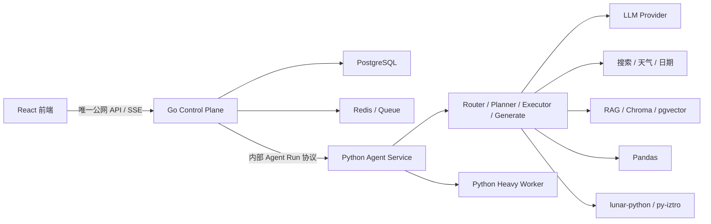
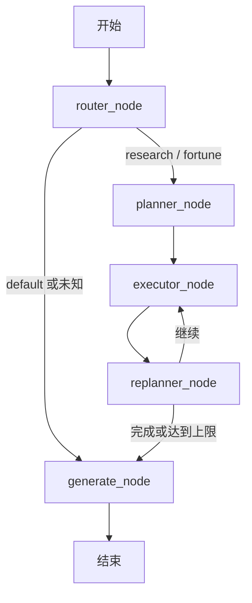
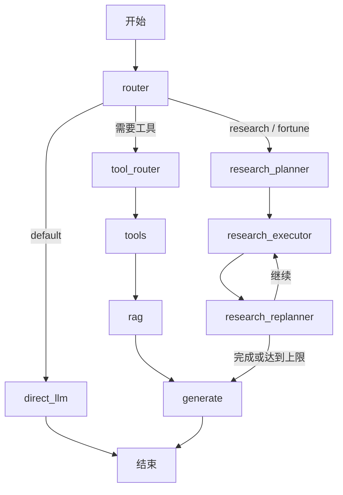
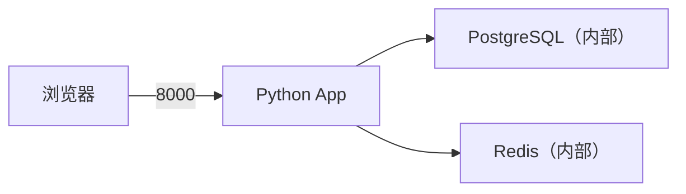
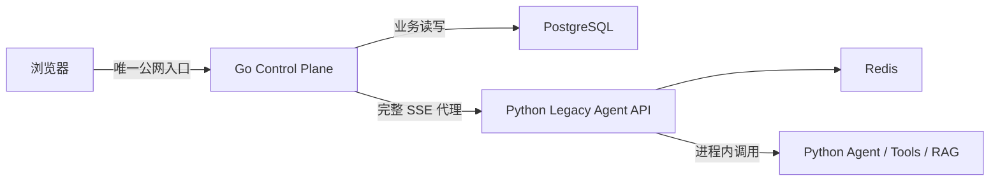
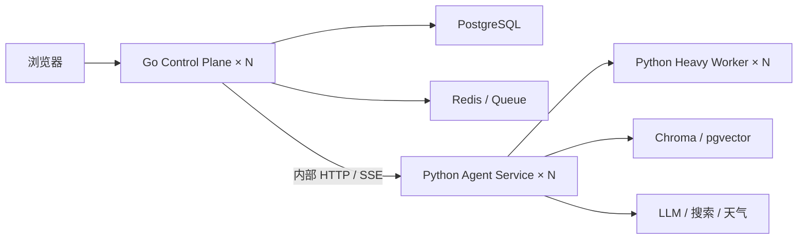

# 奇点 AI：Go 控制面与 Python Agent Service 设计与实施文档

> 文档状态：架构定版修订；Go 网关、认证和会话持久化已落地
> 适用仓库：`qidianAgent`
> 改造范围：后端服务边界与部署形态；前端 React/Vite 保持稳定协议
> 核心策略：Go 负责业务控制面，Python 负责 Agent 执行面，独立部署、统一观测
> 文件名为兼容历史评审链接继续保留，正文已不再采用“Agent 全量 Go 化”路线

---

## 1. 迁移结论

本项目不再以“把 Python Agent 全部迁移到 Go”为目标。当前更合理的终态是：

> **Go 业务控制平台 + Python Agent Service。**

职责划分如下：

1. Go 接管唯一公网入口、认证、用户、会话、消息、Agent Run、限流、配额、SSE、取消、持久化和可观测性。
2. Python 长期负责 Router、Planner、Executor、Replanner、Prompt、LLM、RAG、Pandas、搜索、天气和命理等 Agent 能力。
3. Go 只管理一次 Agent 执行的生命周期，不复制 Python GraphState，也不参与节点级思考和工具选择。
4. Python Agent Service 不直接写入用户、会话、消息和 Run 等业务表；它通过内部事件把执行结果交给 Go 落库。
5. 两个服务通过版本化的内部 HTTP/SSE 协议通信；未来只有在测量确认存在瓶颈时才评估 gRPC。
6. Python Agent 以 Docker 容器独立部署，不暴露公网端口，可与 Go 分别扩容和发布。

目标形态：



这里的“迁移”是把 **Web 业务职责、状态所有权和运行控制权迁移到 Go**，而不是
把适合 Python 的 AI 代码按语言重写。

---

## 2. 当前系统架构

### 2.1 总体调用链

当前带会话持久化的公网流式调用链如下：

```text
React 页面
  -> frontend/src/lib/chat-api.ts
  -> POST /api/v1/conversations/{id}/messages/stream
  -> Go 认证、历史组装、消息和 Agent Run 落库
  -> 内部 POST Python /query_stream
  -> backend/app/api/graph_routes.py
  -> backend/graph/__init__.py::stream_graph（手写流式编排）
  -> router_node
  -> default: generate_node
  -> research/fortune: planner -> executor -> replanner -> generate
  -> Python SSE -> Go 状态更新与公网 SSE
  -> React 增量渲染
```

Go 仍保留兼容 `POST /query_stream`，但前端会话主链路使用 conversation
stream API。Python 内部 `/query_stream` **不调用** `build_graph()` 编译出的
LangGraph，也不经过
`direct_llm_node`。`builder.py`、`direct_llm_node`、`tool_router_node`、
`tools_node` 和它们注册的条件边属于同步兼容路径或遗留设计，不能作为
Agent Service 的现网行为基线。

当前系统可以划分为五层：

| 层级 | 当前实现 | 主要职责 |
|---|---|---|
| 前端交互层 | React、Vite、TypeScript | 会话输入、模式选择、SSE 读取、Markdown 展示 |
| 业务控制层 | Go HTTP API | 认证、会话、消息、Run、SSE 和持久化 |
| Agent API 层 | FastAPI、sse-starlette | 内部请求校验、Agent 调用、流式响应 |
| 编排层 | Python 自定义节点、兼容 LangGraph | 路由、计划、执行、重规划、生成 |
| Agent/工具层 | LangChain、自定义 Python 工具 | 搜索、天气、日期、命理排盘、知识库查询 |
| 数据与模型层 | DashScope、Tavily、Redis、PostgreSQL、Chroma | 模型推理、外部搜索、缓存、关系数据、向量检索 |

### 2.2 现有 Agent

`backend/configs/agents.yaml` 声明了四类 Agent，但当前公网流式入口没有按照
YAML 创建并执行四个独立 Agent。请求名称先转换为 `mode_hint`，再由意图
分类器决定路由，最后只剩 `default`、`research`、`fortune` 三种运行路径。

#### Python Agent 请求基线矩阵

| 请求中的 `agent_name` | Handler 转换 | Router 可能结果 | 实际节点 | 实际生成 Prompt |
|---|---|---|---|---|
| 空值/未传 | `mode_hint=None` | `default` / `research` / `fortune` | 取决于自动分类 | 按最终 route 选择 |
| `default_llm_agent` | 当前未显式识别，按 auto 处理 | 三种 route 均可能 | 不保证 default | 按最终 route 选择 |
| `research_agent` / `research` | `mode_hint=research` | `default` 或 `research` | default 直接 generate；research 走计划循环 | default/research |
| `fortune_agent` / `fortune` | `mode_hint=fortune` | `default` 或 `fortune` | default 直接 generate；fortune 走计划循环 | default/fortune |
| `general_rag_agent` | 当前未显式识别，按 auto 处理 | 三种 route 均可能 | 不保证进入 research | 按最终 route 选择 |

意图路由器内部如果返回 `general_rag_agent`，`router_node` 会把它折叠为
`research`。因此“请求指定 `general_rag_agent`”与“分类器返回
`general_rag_agent`”不是同一种行为。

#### 实际工具基线

research/fortune 共用 `executor_node`。当前真正存在执行分支的是：

- `get_lunar_chart`
- `get_ziwei_chart`
- Tavily 搜索
- `none`/其他名称的逻辑记录

日期、天气虽然出现在工具说明和部分映射代码中，但当前 Executor 没有对应
执行分支；本地 KB、Pandas 和 `deep_research` 也未进入公网流式执行链。
迁移基线必须复现这个现状，新增工具能力作为独立功能变更验收。

### 2.3 当前工作流

系统中同时存在两套编排语义。

#### A. Python Legacy `/query_stream` 实际流程



#### B. 编译图/兼容流程



该流程由 `builder.py` 描述，但不是 Python Legacy 流式入口的当前执行路径。
Agent Runtime 封装不得以它的 `default -> direct_llm` 作为行为基线。

此外，`backend/graph/nodes/rag.py` 中的 RAG 节点处于全局暂停状态。因此，
现阶段研究和命理结果主要依赖 Executor 写入的上下文，而不是完整 RAG
链路。迁移期间保持该状态；启用 RAG 必须作为独立功能变更。

### 2.4 当前 GraphState

当前状态包含以下信息：

- 用户输入和聊天历史；
- 模式提示、强制路由和实际路由；
- 检索文档和格式化上下文；
- 工具执行结果；
- 计划任务、完成项、当前项、执行笔记；
- 迭代次数和最大迭代次数；
- 最终答案、兼容输出字段；
- 元数据、中间步骤和错误信息。

这些语义继续由 Python Agent Runtime 保留，Go 不复制其内部数据格式。

### 2.5 当前 Prompt 基线

实际运行 Prompt 的唯一来源为 `backend/agent/prompts/`，相对路径统一以
`backend/` 为基准。Python 通过 `agent.prompts.loader` 加载，并可计算
SHA-256 内容哈希。

公网流式链使用：

- `intent_classification.txt`
- `planner_research.txt` / `planner_fortune.txt`
- `executor_tool_selection.txt`
- `executor_birth_extract.txt`
- `replanner.txt`
- `generate_default_system.txt` / `generate_research_system.txt` /
  `generate_fortune_system.txt`

`general_prompt.txt`、`fortune_general_prompt.txt` 和 `direct_llm_system.txt`
不属于公网默认流。Agent Service 回归测试必须同时记录 Prompt 路径和
SHA-256；哈希不一致时，不进行回答质量对比。

---

## 3. 迁移目标与非目标

### 3.1 目标

- Go 成为唯一公网业务入口，并持续负责认证、会话和 Agent Run 持久化。
- 保持现有会话 API、`/query_stream` 请求和 SSE 响应兼容。
- 把当前 Python Web 应用收敛成边界清晰、只在内网运行的 Agent Service。
- 为每次执行建立 `execution_id`、超时、取消、幂等、状态查询和资源上限。
- 让 `request_id`、`conversation_id`、`run_id` 和 `execution_id` 贯穿两个服务。
- 业务 PostgreSQL 由 Go 唯一写入；Python 只拥有 Agent 临时状态、向量数据和工具数据。
- Python Agent 容器可独立扩容、滚动升级和故障隔离。
- 通过契约测试和容器级回归保证服务边界稳定。

### 3.2 非目标

当前规划明确不做以下工作：

- 不重写 React 前端。
- 不把 Router、Planner、Executor、Replanner 或 Generate 迁入 Go。
- 不在 Go 和 Python 中各维护一套 LLM Client、Prompt 或工具注册表。
- 不为了语言统一而重写 RAG、Pandas、搜索、天气、日期或命理工具。
- 不要求 Python Agent 无数据库依赖；它仍可访问向量库和专用工具数据，但不能写业务会话表。
- 不立即引入 gRPC、Kubernetes 或复杂消息中间件。
- 不在服务拆分过程中同时改变 Prompt 风格和 Agent 业务规则。

只有在生产测量证明 Python 成为明确瓶颈、工作流已经长期稳定且 Go 重写收益
大于验证成本时，才单独评估某项能力是否迁入 Go。

---

## 4. 目标技术架构

### 4.1 服务划分

建议迁移后保留两个后端服务：

#### Go Control Plane

职责：

- 对外提供 HTTP API；
- 注册、登录、Session、权限和审计；
- 用户、会话、消息和 Agent Run 持久化；
- SSE 公网连接、背压和客户端取消；
- `execution_id` 分配和 Agent 任务生命周期；
- 限流、配额、幂等、超时和熔断；
- 业务 PostgreSQL、Redis 和任务队列访问；
- 日志、指标、链路追踪；
- Agent Service 发现、健康检查和负载均衡；
- 静态前端托管和优雅停机。

Go 不解析 Planner 输出、不选择工具、不拼接 Prompt，也不直接调用 LLM。

#### Python Agent Service

职责：

- Agent 名称解析、意图路由和 GraphState；
- Router、Planner、Executor、Replanner 和 Generate；
- Prompt 加载、版本和 SHA-256 记录；
- LLM 调用、流式解析和模型侧重试；
- 搜索、天气、日期、RAG、Pandas 和命理工具；
- 工具注册表、副作用声明和资源限制；
- 执行级超时、取消和错误分类；
- 将统一执行事件流返回给 Go。

Python Agent Service 只监听容器内部网络，不承担公网认证和业务数据写入。
长时间、阻塞或高内存任务进一步下沉到 Python Heavy Worker，避免阻塞实时聊天。

### 4.2 推荐 Go 工程结构

当前 `go-backend` 继续按业务控制面演进：

```text
go-backend/
├── cmd/
│   └── server/
│       └── main.go
├── internal/
│   ├── api/
│   │   ├── handler/
│   │   ├── middleware/
│   │   ├── request/
│   │   ├── response/
│   │   └── sse/
│   ├── auth/
│   ├── conversation/
│   ├── execution/
│   │   ├── service.go
│   │   ├── events.go
│   │   ├── state.go
│   │   └── agent_client.go
│   ├── platform/
│   │   ├── postgres/
│   │   ├── redis/
│   │   └── queue/
│   ├── observability/
│   └── config/
├── pkg/
│   └── protocol/
├── test/
│   ├── contract/
│   ├── integration/
│   └── fixtures/
├── go.mod
├── go.sum
└── Dockerfile
```

Python Agent 代码继续位于 `backend/`，后续内部结构建议收敛为：

```text
backend/
├── app/
│   ├── main.py
│   └── api/internal_agent_runs.py
├── agent/
│   ├── runtime/
│   ├── prompts/
│   └── tools/
├── graph/
├── rag/
├── workers/
└── tests/
```

`agents.yaml` 和 Prompt 仍由 Python 唯一加载。Go 只保存 Python 上报的
Agent、模型和 Prompt 版本信息，不复制、不解析这些业务配置。

原则：

- Go `internal/httpapi` 只处理公网协议；
- Go `internal/execution` 只理解 Run 生命周期和标准事件；
- Python `graph/agent/tools` 独占 Agent 业务逻辑；
- `pkg/protocol` 只保存稳定的内部请求和事件模型；
- 两个服务不得同时写同一类业务数据；
- Agent 框架替换不得要求修改 Go 或前端。

### 4.3 迁移期部署拓扑基线

Go 接入前的历史 Python 拓扑：



- 生产 Compose 只发布应用端口；
- PostgreSQL 和 Redis 仅在 Compose 内部网络暴露；
- Python 启动入口固定为 `app.main:app`；
- `/healthz` 用于容器健康检查；
- 所有 Secret 由运行环境注入。

当前已落地拓扑：



当前 Go 已负责认证、会话、消息、Agent Run 和公网 SSE，Python 仍通过
`stream_graph` 执行完整 Agent。下一阶段不是把节点迁入 Go，而是把
`/query_stream` 整理成版本化的内部 Agent Run 协议，并补齐执行级取消和观测。

目标 Docker/生产拓扑：



约束：

- Go 是唯一公网入口；
- Python Agent Service 和 Heavy Worker 不发布宿主机端口；
- Go 和 Python 使用独立镜像、健康检查、资源限制和扩容策略；
- Python 容器不得依赖本地临时文件保存唯一业务状态；
- 向量索引、上传文件和模型缓存必须使用持久卷或外部存储；
- 灰度和回滚只改变 Agent Service 版本或流量权重，不复制在线业务数据；
- 健康检查必须区分“进程存活”和“可接受请求”；
- 回滚路径为 Go 把新协议切回当前 Legacy Agent 适配器；
- 开发环境可以显式发布数据库端口，生产环境不允许。

---

## 5. 模块归属与改造方式

| 模块 | 当前职责 | 长期归属 | 改造方式 |
|---|---|---|---|
| `go-backend/internal/httpapi` | 公网 API、SSE、认证适配 | Go | 持续增强 |
| `go-backend/internal/auth` | 用户和 Session | Go | 保持 |
| `go-backend/internal/conversation` | 会话和消息生命周期 | Go | 保持 |
| `go-backend/internal/platform/postgres` | 业务数据持久化 | Go | 保持唯一写入权 |
| `go-backend/internal/execution` | 尚未建立 | Go | 新增 Run 生命周期与 Agent Client |
| `backend/app/main.py` | FastAPI 入口 | Python | 收敛为内部 Agent Service 入口 |
| `backend/app/api/graph_routes.py` | 公网 SSE 与 Graph 调用混合 | Python | 拆成 Legacy 适配器和内部 Run Handler |
| `backend/app/api/intent_router.py` | 意图分类 | Python | 保留 |
| `backend/configs/agents.yaml` | Agent 声明 | Python | 保持唯一加载方 |
| `backend/graph/__init__.py::stream_graph` | 当前实际编排 | Python | 封装到 Agent Runtime |
| `backend/graph/state.py` | GraphState | Python | 保留，不复制到 Go |
| `backend/graph/nodes/**` | Agent 节点 | Python | 保留并补单元测试 |
| `backend/agent/prompts/**` | Prompt 唯一来源 | Python | 保留并上报版本/hash |
| `backend/agent/tools/**` | 搜索、天气、日期和命理工具 | Python | 统一注册表与契约 |
| `backend/rag/**` | RAG、向量和 Pandas 能力 | Python | 保留并资源隔离 |
| `backend/workers/**` | 离线索引任务 | Python Worker | 与实时 Agent 容器分离 |
| `backend/infra/cache/redis_client.py` | Agent 缓存 | Python | 仅保存执行或工具缓存 |
| `backend/infra/db/connection.py` | 未完成的业务 DB 抽象 | 删除或限域 | 不写 Go 业务表 |

原则是按数据所有权和运行职责划分，而不是按“哪个模块容易翻译成 Go”划分。

---

## 6. 对外协议兼容

### 6.1 请求协议

前端主链路：

```http
POST /api/v1/conversations/{conversation_id}/messages/stream
Content-Type: application/json
Accept: text/event-stream
X-CSRF-Token: ...
```

请求体：

```json
{
  "content": "用户问题",
  "client_message_id": "uuid",
  "agent_name": "research_agent"
}
```

Go 根据 `conversation_id` 从数据库组装可信聊天历史。前端不再提交完整历史。
兼容 `POST /query_stream` 暂时保留给旧客户端和契约测试，但不是产品主链路。

主链路规则：

- `content` 必填，去除空白后不能为空；
- `client_message_id` 必须是 UUID，并用于幂等去重；
- `agent_name` 可空，为空时自动路由；
- 支持现有别名：`research`、`fortune`；
- 会话必须属于当前登录用户；
- 写请求必须通过 Session、Origin 和 CSRF 校验；
- 请求体大小必须配置上限；
- 客户端断开后，Go 立即取消代理 Context；Legacy 适配器当前只保证关闭
  Python HTTP 连接，阶段 3 的 Agent Run 协议必须进一步发送执行级取消。

### 6.2 SSE 响应协议

现有前端按行读取 `data:`，因此 Go 必须输出：

```text
event: message
data: {"type":"delta","data":"文本","isThinking":false,"thinkingFinished":true}

```

事件类型：

#### 消息元数据

Go 在开始调用 Python 前发送：

```json
{
  "type": "meta",
  "conversation_id": "uuid",
  "user_message_id": "uuid",
  "assistant_message_id": "uuid",
  "run_id": "uuid"
}
```

前端用它把乐观消息 ID 替换为数据库 ID。该事件属于公网会话协议，不要求
Python Agent Service 生成。

#### 思考进度

```json
{
  "type": "delta",
  "data": "Step1: 搜集相关资料\n",
  "isThinking": true,
  "thinkingFinished": false
}
```

这里输出的是计划或执行进度，不应输出模型的隐式思维链。

#### 答案增量

```json
{
  "type": "delta",
  "data": "答案片段",
  "isThinking": false,
  "thinkingFinished": true
}
```

#### 完成

```json
{
  "type": "done"
}
```

#### 失败

```json
{
  "type": "error",
  "message": "处理失败"
}
```

### 6.3 SSE 实现要求

- 响应头必须包含 `Content-Type: text/event-stream`；
- 设置 `Cache-Control: no-cache`；
- 设置 `X-Accel-Buffering: no`，避免 Nginx 缓冲；
- 每条事件以空行结束；
- 每次写入后调用 Flush；
- 长时间无内容时发送注释心跳，如 `: ping\n\n`；
- 不在 error 事件中暴露 API Key、内部地址、堆栈或完整上游响应；
- 服务端必须区分“请求已取消”和“系统执行失败”；
- 记录首包耗时、总耗时、delta 数、输出字符数和取消原因。

### 6.4 协议版本

建议新增可选响应头：

```text
X-Agent-Protocol-Version: 1
```

第一阶段不改变 JSON 内容。后续新增事件字段时遵循只增不删，前端忽略未知字段。

---

## 7. Go 执行控制模型

### 7.1 Run 生命周期

Go 不保存 Python GraphState，只保存跨服务稳定、可持久化的执行状态：

```go
type RunState string

const (
    RunQueued    RunState = "queued"
    RunRunning   RunState = "running"
    RunCompleted RunState = "completed"
    RunStopped   RunState = "stopped"
    RunFailed    RunState = "failed"
)

type AgentRun struct {
    ID             string
    ExecutionID    string
    RequestID      string
    ConversationID string
    AgentName      string
    ModelName      string
    State          RunState
    StartedAt      time.Time
    FirstTokenAt   *time.Time
    CompletedAt    *time.Time
}
```

Go 负责：

- 分配 `run_id`、`execution_id` 和 `request_id`；
- 防止同一会话出现多个活动 Run；
- 保存用户消息和 Assistant 占位消息；
- 启动 Python Agent、转发事件并更新状态；
- 在客户端取消、超时或服务退出时发出取消指令；
- 将 Python 上报的模型、Prompt、工具和 Token 信息持久化。

### 7.2 内部事件模型

Go 只理解稳定事件，不理解 Python 节点内部对象：

```go
type AgentEvent struct {
    Version     int             `json:"version"`
    ExecutionID string          `json:"execution_id"`
    Sequence    int64           `json:"sequence"`
    Type        string          `json:"type"`
    Data        json.RawMessage `json:"data"`
    OccurredAt  time.Time       `json:"occurred_at"`
}
```

事件类型至少包括：

- `run.started`
- `route.selected`
- `progress`
- `tool.started`
- `tool.completed`
- `answer.delta`
- `usage`
- `run.completed`
- `run.failed`
- `run.stopped`

Python 可增加内部节点，但不能未经协议版本升级改变已有事件语义。Go 将
`answer.delta` 转成现有公网 SSE，将其他事件用于状态、日志和可观测性。

### 7.3 数据写入权

- Go 唯一写入 `users`、`sessions`、`conversations`、`messages`、
  `agent_runs` 和后续 `agent_run_steps/events`；
- Python 不接收业务数据库凭据，不能直接修改这些表；
- Python 可读写自己拥有的向量库、索引、模型缓存和临时执行数据；
- Python 事件可能重复，Go 必须按 `execution_id + sequence` 幂等消费；
- Run 完成后的终态只能单向迁移，迟到事件不得把终态改回 `running`。

---

## 8. Python Agent Runtime 与 LLM 层

### 8.1 Agent Runtime 接口

Python 内部使用统一 Runtime，HTTP Handler 不直接调用具体 Graph 节点：

```python
class AgentRuntime(Protocol):
    async def stream(
        self,
        request: AgentRunRequest,
        cancel: CancellationToken,
    ) -> AsyncIterator[AgentEvent]:
        ...
```

Runtime 负责解析 Agent、构建 GraphState、执行工作流并发出标准事件。
FastAPI Handler 只负责内部鉴权、请求校验、取消绑定和事件序列化。

### 8.2 LLM Client

LLM Client 保持在 Python，并由 Agent Runtime 统一注入。节点不得各自创建
厂商客户端或读取 API Key。DashScope 适配器负责：

- 请求和响应模型映射；
- API Key 注入；
- HTTP 超时和连接复用；
- 状态码与错误分类；
- 流式帧解析；
- 使用量采集；
- Prompt/模型版本上报；
- 日志敏感信息过滤。

### 8.3 超时与重试

建议默认值：

| 调用类型 | 建议超时 | 重试 |
|---|---:|---:|
| 意图分类 | 10–20 秒 | 最多 1 次 |
| Planner | 30–60 秒 | 最多 1 次 |
| 单次工具调用 | 10–60 秒 | 按工具配置 |
| Replanner | 20–40 秒 | 最多 1 次 |
| 最终生成 | 60–180 秒 | 流式开始后不自动重放 |
| Python RAG | 60–180 秒 | 仅幂等查询可重试 |

重试只适用于：

- 连接建立失败；
- 临时 DNS/网络错误；
- HTTP 429；
- 明确的 5xx；
- 尚未向前端输出任何答案增量的请求。

一旦已经向前端发送答案 delta，不应在后台静默重跑整次生成，否则可能输出重复内容。

---

## 9. Python 工具体系设计

### 9.1 统一工具注册表

工具注册表位于 Python Agent Service：

```python
@dataclass(frozen=True)
class ToolDefinition:
    name: str
    description: str
    input_schema: dict
    effect: Literal["read", "write", "destructive"]
    idempotent: bool
    shadow_allowed: bool
    timeout_seconds: int
    max_input_bytes: int
    max_output_bytes: int
    concurrency_class: str
```

Router/Executor 只通过 Registry 查找工具，不能散落 `if tool_name == ...` 的
执行分支。Go 不维护第二份工具注册表，只消费 Python 发出的工具事件。

注册时执行强校验：

- `destructive` 工具必须设置 `ShadowAllowed=false`；
- 非幂等写工具必须拒绝自动重试；
- 需要幂等键的工具缺少 Key 时拒绝执行；
- 输入、输出、超时和并发类别必须有有限值；
- 影子请求只能调用 `Effect=read && ShadowAllowed=true` 的工具。

不能仅根据工具名称判断副作用。例如 `query_local_kb` 在服务尚未初始化时
可能隐式构建索引，因此只有显式进入只读、已初始化模式后才允许影子调用；
`init_local_rag(force=true)` 属于 destructive，始终禁止影子执行。

### 9.2 工具归属

以下能力统一保留在 Python：

- 当前日期、Tavily 搜索和天气；
- `query_local_kb`、`init_local_rag`；
- `query_pandas_data`、`init_pandas_rag`；
- `get_lunar_chart`、`get_ziwei_chart`；
- 文档解析、Embedding、Reranker 和命理 RAG。

纯 HTTP 工具也暂不迁 Go，避免同一个 Agent 的工具选择、执行和观测跨两种
语言。未来只有与 Agent 无关的业务工具，例如计费或账户查询，才由 Go 直接
实现。

### 9.3 Heavy Worker

以下任务不得在实时 Agent Web 进程中长期阻塞：

- 大文件解析和索引构建；
- Pandas 大数据集查询；
- 大批量 Embedding；
- 不响应 asyncio 取消的同步库调用。

它们通过队列投递到独立 Worker 进程，使用 `execution_id` 查询状态和取消。
Worker 可被终止，Agent Service 故障或扩容不影响任务状态。

---

## 10. Python Agent Service 协议

### 10.1 推荐接口

初期使用内部 HTTP/JSON + SSE，便于调试、抓取契约样例和复用现有流式实现。
只有实际测量证明序列化或连接成本成为瓶颈时才评估 gRPC。

#### 健康检查

```http
GET /internal/health
```

#### 能力与版本

```http
GET /internal/v1/capabilities
```

返回协议版本、Agent 列表、模型适配器、工具注册表版本和构建版本；不返回
Prompt 正文、密钥或敏感配置。

#### 创建并流式执行

```http
POST /internal/v1/agent-runs:stream
Content-Type: application/json
Accept: text/event-stream
X-Request-ID: ...
Authorization: Bearer <internal-service-token>
```

请求：

```json
{
  "version": 1,
  "execution_id": "exec_xxx",
  "run_id": "run_xxx",
  "request_id": "req_xxx",
  "conversation_id": "conv_xxx",
  "agent_name": "research_agent",
  "query": "用户问题",
  "chat_history": [
    {"role": "user", "content": "上一轮问题"},
    {"role": "assistant", "content": "上一轮回答"}
  ],
  "deadline_ms": 120000,
  "shadow": false,
  "metadata": {
    "locale": "zh-CN"
  }
}
```

第一帧必须是：

```json
{
  "version": 1,
  "execution_id": "exec_xxx",
  "sequence": 1,
  "type": "run.started",
  "data": {
    "agent_name": "research_agent"
  }
}
```

后续按递增 `sequence` 发送标准事件。Run 完成时必须且只能出现一个终态事件。
`execution_id` 由 Go 在请求前生成，Python 对重复 ID 返回同一执行或明确的
幂等冲突，不能重复启动任务。

#### 查询执行

```http
GET /internal/v1/agent-runs/{execution_id}
```

状态机：

```text
queued -> running -> completed
                   -> failed
                   -> cancel_requested -> stopped
                   -> timed_out
```

响应至少包含：

```json
{
  "execution_id": "exec_xxx",
  "status": "running",
  "last_sequence": 12,
  "started_at": "2026-07-26T01:00:00Z",
  "deadline_at": "2026-07-26T01:02:00Z"
}
```

#### 取消执行

```http
DELETE /internal/v1/agent-runs/{execution_id}
```

取消规则：

1. Go 检测到客户端停止、Run 超时或服务关闭后立即发送取消请求；
2. Python 服务同时执行自己的硬截止时间，不能只信任 Go 的
   `deadline_ms`；
3. Agent Runtime、LLM 流和 asyncio 工具使用协作式取消；
4. Pandas、Chroma、同步库和无法响应协作式取消的任务放入独立 Worker
   进程；
5. 达到取消宽限期后终止 Worker 进程，不使用不可终止的线程承载长任务；
6. 写任务必须用幂等键或事务处理进程中止后的重试；
7. `cancel_requested` 不等于已取消，只有 Worker 停止后才能标记
   `stopped`。

### 10.2 安全与执行约束

- 只监听容器内部网络或内网地址；
- 不对公网暴露；
- Go 和 Python 服务间使用服务凭据；跨主机部署时优先 mTLS；
- 每个请求设置最大 body；
- 对文件路径做白名单限制；
- 禁止从请求中接收任意 Python 代码、SQL 或系统命令并直接执行；
- 日志中不记录原始密钥和完整敏感文档；
- Python 服务必须执行超时和并发上限；
- 每次工具执行都要检查副作用元数据；
- 影子请求由 Python 注册表强制拒绝非只读工具；
- Go 发出取消指令后必须跟踪 Python 的最终状态；
- 不可取消任务必须隔离到可终止 Worker，不能仅记录超时后继续后台运行。

---

## 11. 配置迁移

### 11.1 配置优先级

建议统一为：

```text
环境变量 > 配置文件 > 程序默认值
```

### 11.2 Agent 配置

`agents.yaml` 由 Python Agent Service 唯一加载。不能假定所有字段当前都已
生效；应为每个字段标注 `effective`、`declared_only` 或 `legacy`：

- `name`
- `description`
- `is_default`
- `llm`
- `mode`
- `tools`
- `prompt_template_path`
- `max_iterations`
- `max_execution_time`
- RAG 相关配置

Python Agent Service 启动时完成：

1. YAML 解析；
2. 字段默认值填充；
3. Agent 名称唯一性检查；
4. 默认 Agent 唯一性检查；
5. 工具名称存在性检查；
6. Prompt 文件存在性检查；
7. 时间和迭代范围检查。

无效配置应使 Python readiness 失败，不应等到请求执行时才报错。Go 通过
`/internal/v1/capabilities` 获取可用 Agent 和版本，不解析 YAML。

### 11.3 Prompt 来源、版本与路径

- 当前唯一来源：`backend/agent/prompts/`；
- 相对路径基准：仓库中的 `backend/` 目录；
- Python 加载器：`backend/agent/prompts/loader.py`；
- Prompt 文件固定为 UTF-8、LF，不允许 BOM；
- 文件哈希规范：对文件原始字节直接执行 SHA-256；Python 使用
  `Path.read_bytes()`，不得 `.strip()`、转换换行或重新编码后再计算；
- 运行记录：在 `metadata.prompt_versions` 中追加每次实际调用的阶段、相对
  路径、原始文件 SHA-256、渲染后文本 SHA-256 和迭代次数；
- 关键词短路等没有调用 LLM Prompt 的路径不写入伪记录；
- Python 把实际 Prompt 版本随 Run 事件上报给 Go 落库；
- Prompt 变更与服务边界改造分开评审；
- 回归结果对比只在 Prompt hash 相同时有效；
- 遗留的 `general_prompt.txt` 和 `fortune_general_prompt.txt` 不自动启用。

### 11.4 Secret 管理

迁移启动前必须完成：

1. 撤销并轮换所有曾提交到仓库的 API Key 和数据库密码；
2. 当前文件和 Git 历史一律按“已泄露”处理，不能只删除当前行；
3. 本地使用被 Git 忽略的 `.env`；
4. 部署使用平台 Secret、Docker Secret 或 Kubernetes Secret；
5. CI/CD 只通过受保护变量注入，不把 Secret 写入构建参数或镜像层；
6. 增加 Secret 扫描并阻止新凭据提交；
7. 开发、测试和生产凭据隔离；
8. 日志、错误事件和 Trace 对连接串、Authorization、Key 做脱敏；
9. 如需清理 Git 历史，必须在凭据轮换后协调所有协作者执行历史重写。

当前仓库侧已改为环境变量引用，但外部平台上的撤销和轮换仍是人工 Gate。
在该 Gate 完成前，不进行公网/生产部署，也不复制仓库到新的远端；不阻塞
本地开发环境继续验证 Go 网关。

### 11.5 环境变量

建议至少统一：

```text
APP_ENV
HTTP_ADDR
ENVIRONMENT
PORT
REDIS_URL
DATABASE_URL
PYTHON_AGENT_SERVICE_URL
PYTHON_AGENT_SERVICE_TOKEN
AGENT_PROTOCOL_VERSION
REQUEST_TIMEOUT
SSE_HEARTBEAT_INTERVAL
LOG_LEVEL
OTEL_EXPORTER_OTLP_ENDPOINT

# 仅注入 Python Agent Service
DASHSCOPE_API_KEY
DASHSCOPE_BASE_URL
LLM_MODEL_NAME
TAVILY_API_KEY
SENIVERSE_API_KEY
```

迁移期环境变量映射：

| 当前 Python 变量 | Go 目标变量 | 过渡规则 |
|---|---|---|
| `ENVIRONMENT` | `APP_ENV` | Go 优先读取 `APP_ENV`，为空时兼容 `ENVIRONMENT` 并记录弃用告警 |
| `PORT` | `HTTP_ADDR` | Go 优先读取 `HTTP_ADDR`；仅有 `PORT=8000` 时转换为 `:8000` |
| `PYTHON_BASE_URL` | `PYTHON_AGENT_SERVICE_URL` | 协议切换稳定后弃用旧名 |
| `INTERNAL_AGENT_SECRET` | `PYTHON_AGENT_SERVICE_TOKEN` | 轮换后使用服务级凭据 |

模型和工具 API Key 不再注入 Go 容器。它们只存在于 Python Agent Service，
Heavy Worker 按最小权限单独注入所需 Secret。

端口只允许有一个权威配置来源。当前 Docker、启动脚本、开发代理和文档已统一
为 8000；Go 服务落地后通过独立内部端口运行，由唯一公网入口转发，不再让
前端分别感知 Python/Go 端口。

---

## 12. 数据与状态

### 12.1 会话状态

当前已由 Go 和 PostgreSQL 实现用户级会话、消息和 Agent Run 持久化：

- Go 根据 `conversation_id` 组装历史并传给 Python；
- 前端不再是聊天历史的权威来源；
- Python 不直接读取或修改业务会话表；
- Redis 保存短期运行状态、限流、幂等键和可选任务队列；
- 所有数据查询必须带用户或租户边界；
- 软删除会话需要后续保留期和物理清理策略。

### 12.2 向量数据

迁移期间：

- Chroma 数据目录继续由 Python 服务独占读写；
- Go 不直接访问 Chroma 文件；
- 索引初始化通过 Python 内部接口触发；
- 索引构建和在线查询设置资源隔离；
- 索引版本、Embedding 模型和切分参数写入元数据；
- 新索引构建成功后再原子切换。

### 12.3 缓存

缓存 Key 应包含：

- 协议版本；
- Agent 名称；
- 模型名称；
- Prompt 版本；
- 工具或知识库版本；
- 输入摘要。

否则 Prompt 或模型升级后可能命中旧答案。

---

## 13. 可观测性

每个请求生成唯一 `request_id`，贯穿：

```text
浏览器 -> Go Control Plane -> Python Agent Runtime -> LLM/工具 -> Go 落库
```

### 13.1 日志字段

至少记录：

- `request_id`
- `trace_id`
- `agent_name`
- `route`
- `node`
- `tool_name`
- `model`
- `attempt`
- `duration_ms`
- `first_token_ms`
- `input_size`
- `output_size`
- `status`
- `error_code`

默认不记录：

- API Key；
- 数据库密码；
- 完整 Authorization；
- 完整用户隐私内容；
- 未脱敏文档正文；
- 模型隐式思维链。

### 13.2 指标

建议指标：

- 请求数、成功率、取消率；
- P50/P95/P99 总耗时；
- 首 token 延迟；
- SSE 活跃连接数；
- 各 Agent 请求占比；
- 各节点耗时；
- 各工具调用次数、失败率和耗时；
- LLM 状态码和重试次数；
- Planner 平均任务数；
- 平均迭代次数和触顶次数；
- Python Agent Service 活动 Run、队列长度和 Worker 饱和度；
- Redis/PostgreSQL 连接池状态。

### 13.3 链路追踪

建议使用 OpenTelemetry。每个节点和外部调用建立 Span：

```text
query_stream
  ├── go.persist_run
  ├── python.agent_run
  │   ├── route
  │   ├── plan
  │   ├── execute.tool.tavily
  │   ├── replan
  │   └── generate.stream
  └── go.persist_result
```

### 13.4 当前落地：结构化执行记录 V1

当前实现采用“Python 产生事实，Go 持久化并提供查询”的单一事实源模型：

```text
Python Graph 节点
  -> prompt.used / model.* / tool.* / usage
  -> Python 出境脱敏
  -> Go 内网协议
  -> Go 入库前二次脱敏
  -> PostgreSQL Run / Span / Event / Prompt 投影
```

数据库职责：

- `agent_runs`：一行运行摘要、版本、终态、token、调用次数和总耗时；
- `agent_run_spans`：模型与工具调用的开始、结束、耗时和错误；
- `agent_run_events`：状态、路由、Prompt、模型、工具、用量和终态等关键事件；
- `prompt_artifacts`：Prompt 文件哈希与相对路径；
- `agent_run_prompts`：某次运行实际使用的 Prompt、阶段和渲染后哈希。

为控制存储量，`answer.delta` 和 `progress` 只用于实时 SSE，不进入
`agent_run_events`。最终回答继续由消息表保存，运行详情不会复制一份回答正文。

内容采集默认是 `hashed`：

- Prompt 不保存正文；
- 工具输入输出不保存原值，只保存 SHA-256、字节数和类型；
- 模型只保存模型名、耗时与用量；
- Python 与 Go 都对认证、Cookie、密码、密钥和连接串字段执行脱敏；
- `input_tokens`、`output_tokens` 等用量字段不按认证令牌处理。

公网查询由 Go 提供，并按登录用户隔离：

```text
GET /api/v1/agent-runs?status=failed&limit=30
GET /api/v1/agent-runs/{run_id}
```

V1 暂不实现完整 OpenTelemetry Exporter；数据库中的 `trace_id`、`span_id` 与
事件顺序已经固定，可在后续接入 OTLP 时保持现有公网 API 和数据库事实源不变。

---

## 14. 测试策略

服务拆分不是验证“能不能回答”，而是验证“拆分前后在同一输入下是否满足
相同契约和质量要求”。

### 14.1 契约测试

固定验证：

- 请求字段兼容；
- 空问题返回 400；
- agent 别名兼容；
- SSE 响应头正确；
- `delta` JSON 字段正确；
- `done` 只发送一次；
- `error` 格式正确；
- UTF-8 中文不乱码；
- 多个网络分片下仍能被前端解析；
- 客户端取消后服务端停止执行；
- Nginx/网关不缓冲。

### 14.2 Python Runtime 与节点单元测试

在 Python 中使用 Mock LLM 和 Mock Tool 分别测试：

- 路由结果；
- Planner 的结构化输出解析；
- 空计划和非法计划；
- 工具不存在；
- 工具超时；
- Replanner 继续/终止；
- 最大迭代保护；
- Generate 流式输出；
- CancellationToken 取消传播；
- 错误是否正确分类。

Go 侧单元测试聚焦 Run 状态机、事件幂等、终态保护、数据库事务、SSE 映射和
Agent Client 超时，不复制节点测试。

### 14.3 黄金样本

建立一组固定用例：

| 类别 | 建议数量 | 示例 |
|---|---:|---|
| 默认问答 | 30+ | 常识、解释、改写 |
| 深度研究 | 30+ | 对比、综述、时效搜索 |
| 命理工具 | 30+ | 公历/农历、八字、紫微 |
| 本地 RAG | 30+ | 文档中可回答/不可回答问题 |
| Pandas | 20+ | 聚合、筛选、排序、异常输入 |
| 错误场景 | 20+ | 超时、断网、缺配置、非法参数 |

评估维度：

- 是否选择正确 Agent；
- 是否调用正确工具；
- 工具参数是否正确；
- 是否有依据地回答；
- 是否出现明显事实差异；
- 是否完成流式响应；
- 总耗时和首包耗时；
- 错误是否可理解且不泄露内部信息。

### 14.4 Agent Service 影子版本

新 Python Agent Service 版本上线但不直接返回结果时，可复制只读请求：

- 稳定 Python 版本继续返回给用户；
- 候选 Python 版本只用于离线比较；
- 请求上下文强制设置 `shadow=true`；
- Python Registry 只允许 `Effect=read && ShadowAllowed=true`；
- 写、初始化、刷新、删除、发送消息等工具一律拒绝；
- `query_local_kb` 只有在明确禁止隐式初始化时才能进入影子流量；
- 影子请求不继承生产写权限；
- 控制额外 LLM 成本；
- 对敏感数据遵循现有隐私策略。

比较内容：

- Agent 和路由；
- 工具序列；
- 状态机终止原因；
- 最终答案长度和质量；
- 首包和总耗时；
- 错误率。

---

## 15. 分阶段迁移计划

### 阶段 0：建立基线

目标：完成安全、真实行为和部署拓扑三项迁移门禁。

工作项：

- 撤销并轮换已经进入版本库的 API/数据库凭据；
- 确认 Compose、镜像和日志中不再包含明文 Secret；
- 增加 Secret 扫描；
- 固定 API 请求/响应样例；
- 记录 SSE 原始帧；
- 固化“请求 Agent → mode_hint → route → 节点 → 工具 → Prompt hash”矩阵；
- 把公网手写 `stream_graph` 与编译图/遗留节点分开记录；
- 建立黄金样本；
- 记录当前成功率、首包延迟和总耗时；
- 标记当前已暂停或未完成的功能；
- 固定 Prompt 唯一来源、相对路径基准和 SHA-256；
- 修复当前 Python Docker 启动路径和健康检查；
- 固定迁移期部署拓扑、内部网络和唯一公网入口；
- 定义 Go/Python 端口、服务名和回滚路由；
- 修复前端吞掉 SSE error 的问题，避免迁移错误无法被观察。

验收：

- 已完成外部凭据轮换；
- Docker Compose 可从干净环境启动 Go、Python、PostgreSQL 和 Redis；
- PostgreSQL/Redis 不暴露生产公网端口；
- 明确记录四个请求 Agent 名称并不等于四条独立运行链；
- 测试覆盖三条实际 route 和各类请求别名；
- 有一份可自动运行的协议测试；
- 可以明确判断 Go 是否兼容当前系统。

回滚：此阶段不切流，无回滚风险。

### 阶段 1：Go API 外壳与 SSE

状态：主体已完成。

目标：Go 提供唯一公网 API，实际 Agent 长期由 Python 执行。

调用链：

```text
Frontend -> Go conversation stream API -> Python /query_stream -> Go 转发 SSE -> Frontend
```

工作项：

- 创建 Go 工程；
- 在 Compose 中增加 Go、Python、PostgreSQL、Redis 的明确服务拓扑；
- Go 是唯一公网入口，Python 只监听内部网络；
- Go 接管认证、会话、消息和 Agent Run 业务数据；
- 实现健康检查和 `/query_stream`；
- 实现请求校验、请求 ID、日志和中间件；
- 实现 SSE 透传；
- 客户端取消后，Go 停止写 SSE，并取消/关闭发往 Python Legacy API 的 HTTP
  请求；
- 记录可能仍在 Python 内部运行的遗留孤儿任务指标；
- 增加超时和连接池；
- 建立协议自动化测试。

验收：

- 前端切到 Go 地址后功能表现不变；
- SSE 不丢帧、不合并、不乱码；
- 客户端停止生成后，Go 在可接受时间内关闭浏览器侧 SSE 和 Python 侧 HTTP
  连接；
- 本阶段不承诺同步 `llm.invoke()`、Pandas、Chroma 或阻塞工具立即停止；
  Runtime/LLM 执行级取消在阶段 3 验收，阻塞 Worker 终止在阶段 4 验收；
- Go 网关增加的额外延迟可忽略。

回滚：Go 保留 Legacy Agent Client；新内部协议故障时切回当前 Python
`/query_stream` 适配器，业务数据不回滚。

### 阶段 2：Python Agent Service 边界

目标：把当前 Python Web 应用整理成正式内部 Agent Service，不改变 Agent
回答行为。

工作项：

- 定义版本化 `AgentRunRequest` 和 `AgentEvent`；
- 新增 `/internal/v1/agent-runs:stream`、状态查询和取消接口；
- 把 `stream_graph` 封装进 `AgentRuntime`；
- 统一 Agent 名称解析、Prompt 记录和工具注册表；
- Python 不再写业务会话和 Run 表；
- 增加内部服务鉴权、body 上限、超时和并发限制；
- 为旧 `/query_stream` 保留临时 Legacy 适配器；
- 建立 Agent Service 容器和协议契约测试。

验收：

- default、research、fortune 的回答和工具行为不因拆服务改变；
- Python 只通过内部网络访问；
- 每个事件带版本、`execution_id` 和单调递增 `sequence`；
- Go 可在不理解 GraphState 的情况下完整转发和落库；
- 候选服务可一键切回 Legacy 适配器。

### 阶段 3：执行生命周期与可观测性

目标：Go 完整管理 Run，Python 完整管理 Agent。

工作项：

- Go 新增 `execution` 服务和 Python Agent Client；
- 增加 `agent_run_events` 或 `agent_run_steps` 数据结构；
- 填充 `model_name`、Prompt hash、route、工具、Token 和错误码；
- 实现重复事件幂等、终态保护和断线恢复策略；
- 客户端取消传播到 Python Runtime、LLM 和工具；
- 接入 OpenTelemetry 和跨服务 Trace；
- 建立 Run 状态、事件顺序和故障注入测试。

验收：

- 数据库 Run、消息状态和 Python 终态一致；
- 取消后没有不可见的长期孤儿任务；
- 可以回答“哪次请求、哪个模型、哪个 Prompt、哪些工具、耗时多少”；
- Python 重启、Go 重启或网络中断不会产生重复消息。

### 阶段 4：Heavy Worker 与工具治理

目标：隔离高耗时、阻塞和高内存 Python 任务。

工作项：

- 建立带副作用、幂等性、影子权限和资源上限的工具注册表；
- 把索引构建、Pandas 大任务和阻塞工具迁入独立 Worker；
- 引入 Redis Streams、NATS 或 RabbitMQ 之一，按实际需求选择；
- 实现 Worker 状态查询、超时、取消和进程终止；
- 为搜索、天气、RAG、Pandas 和命理建立输入输出契约测试；
- 对 Agent Web 容器和 Worker 设置独立 CPU/内存/并发限制。

验收：

- 重工具不会阻塞实时 SSE；
- Worker 可水平扩容，任务状态不依赖单个进程内存；
- Python 工具故障不会拖垮 Go API 或 Agent Web；
- 非只读工具不能进入影子执行。

### 阶段 5：生产部署与灰度

目标：Go Control Plane 和 Python Agent Service 分别成为可独立扩容的生产服务。

工作项：

- 为 Go、Agent、Worker 构建独立镜像；
- Python 和 Worker 不暴露公网端口；
- 设置连接池、readiness、资源限制和自动重启；
- 增加限流、熔断、负载保护和队列背压；
- 按 Agent Service 版本 1% → 5% → 20% → 50% → 100% 灰度；
- 每阶段观察错误率、延迟、成本、工具成功率和回答质量。

停止灰度条件：

- 错误率或首包耗时明显高于基线；
- 出现重复 delta、缺失终态或消息状态不一致；
- Agent/Worker 过载或队列持续增长；
- 工具失败率或 LLM 成本异常上升。

回滚：Go 将新 Run 切回稳定 Agent Service 版本；已完成的业务数据不回滚。

### 阶段 6：能力演进与可选技术替换

长期候选工作：

- 评估向量库服务化、对象存储和索引版本治理；
- 评估多租户、配额、计费和任务优先级；
- 评估多模型路由和 Agent 版本灰度；
- 只有测量证明收益明确时，才评估将单个纯 HTTP 工具迁入 Go；
- 不以删除 Python 为完成标准。

---

## 16. 灰度开关设计

建议至少支持以下配置：

```yaml
agent_service:
  protocol_version: 1
  stable_url: http://agent-stable:8000
  candidate_url: http://agent-candidate:8000
  default_target: stable
  legacy_fallback_enabled: true
  rollout:
    candidate_percent: 0
    allowed_agents:
      - default_llm_agent
      - research_agent
```

路由维度可包含：

- Agent；
- 用户白名单；
- 请求 Header；
- 百分比；
- 环境；
- Agent Service 构建版本。

灰度单位是完整的 Python Agent Service 版本，不在 Go/Python 之间拆分同一次
Agent 的节点或工具。开关由 Go 加载，生产动态配置需要版本、审计和回滚。

---

## 17. 风险清单

| 风险 | 影响 | 应对 |
|---|---|---|
| 内部 Agent 事件丢失或重复 | 消息错乱、Run 无法结束 | `execution_id + sequence` 幂等、终态保护、契约测试 |
| Go/Python 数据双写 | 状态冲突、难以恢复 | Go 独占业务表，Python 只发事件 |
| Planner JSON 不稳定 | 工作流中断 | 严格 Schema、容错解析、一次修复重试 |
| 状态机无限循环 | 资源耗尽 | 最大迭代、总超时、重复任务检测 |
| 客户端断开后仍继续执行 | 成本浪费 | Context 取消贯穿 LLM、工具和 Python 服务 |
| Python Agent Service 成为瓶颈 | 延迟和故障集中 | 无状态化、并发上限、熔断、水平扩容 |
| 阻塞工具拖垮实时 Agent | 所有聊天变慢 | Heavy Worker、队列、进程级终止 |
| RAG 行为在迁移时被意外改变 | 结果不可比 | 固定当前启停状态，功能变更另立需求 |
| Chroma 文件并发访问 | 索引损坏或查询异常 | 由 Python 服务独占访问 |
| SSE 被代理缓冲 | 前端长时间无输出 | 禁用缓冲、心跳、部署环境端到端测试 |
| 错误信息泄密 | 安全事件 | 统一错误码，对外消息脱敏 |
| Agent 配置漂移 | 行为不一致 | Python 单一配置源、能力版本和启动校验 |
| 一次性全量切换 | 难定位、难回滚 | Agent Service 版本灰度和影子流量 |

---

## 18. 完成标准

只有同时满足以下条件，才能认为服务边界改造完成：

- 前端无需特殊分支即可使用 Go 服务；
- `/query_stream` 契约测试全部通过；
- Go 接受现有四种 Agent 请求名称/别名，并把完整请求交给 Python；
- Router、Planner、LLM、Prompt 和工具只有 Python 一份实现；
- Go 是用户、会话、消息和 Run 的唯一业务数据写入方；
- Python Agent Service 不暴露公网端口；
- 客户端取消能有效终止下游工作；
- 无无限循环、无边界 goroutine 和长期孤儿 Worker；
- P95 首包、总耗时和错误率达到约定目标；
- 日志、指标、Trace 可关联到同一请求；
- Agent Service 可独立水平扩容和滚动发布；
- 已完成候选 Agent Service 版本灰度和稳定观察；
- 有经过验证的 Legacy/稳定版本回滚路径；
- 部署、开发、测试和故障处理文档已更新。

---

## 19. 推荐实施顺序

按照收益、风险和依赖关系，建议严格遵循：

```text
协议测试
  -> Go SSE 网关
  -> Go 认证与会话持久化
  -> Python Agent Service 内部协议
  -> Go Run 生命周期与事件落库
  -> 执行级取消和可观测性
  -> Python 工具注册表
  -> Heavy Worker 与队列
  -> Agent Service 版本灰度
  -> 清理 Python 公网 Legacy API
```

不建议再实现 Go LLM、Go Router 或 Go Research 状态机。这样会让同一个 Agent
跨两种语言维护两份行为，增加 Prompt 漂移、回归和调试成本。

---

## 20. 第一轮开发任务清单

第一轮可以拆成以下可交付任务：

- [x] 移除当前 Compose 和示例配置中的明文凭据
- [ ] 在外部平台撤销并轮换已提交过的凭据
- [ ] 增加 CI Secret 扫描和提交门禁
- [x] 修复当前 Docker/Compose 路径、内部网络和健康检查
- [x] 固化实际 Prompt 来源、路径基准和 SHA-256
- [x] 修正文档中的公网实际执行链和 Agent 基线矩阵
- [x] 固化 `/query_stream` 请求和 SSE 响应契约
- [x] 增加 Python 服务协议回归测试
- [x] 修复前端 SSE `error` 被吞掉的问题
- [x] 统一 Docker 开发和部署端口为 8000
- [x] 初始化 `go-backend` 工程
- [x] 实现配置加载和启动校验
- [x] 实现健康检查
- [x] 实现请求 ID、日志、恢复中间件
- [x] 实现透传式 SSE Writer；阶段 1 不注入心跳，避免改变 Python 原始帧
- [x] 实现 Go 到 Python 的 SSE 代理
- [x] 实现 Go 用户、Session、会话、消息和 Agent Run 持久化
- [x] 定义 `AgentRunRequest` / `AgentEvent` v1
- [x] 实现 Python `AgentRuntime` 和内部流式接口
- [x] 实现 `execution_id`、状态查询、执行级取消和终态保护
- [x] 实现 Go Legacy/V1 Agent Client 和事件幂等落库
- [ ] 填充模型、Prompt、工具、Token 和耗时轨迹
- [x] 建立 Python Agent Service 协议回归测试
- [x] 把阻塞工具隔离到可终止的进程 Worker
- [x] 增加 Legacy/V1 协议切换开关

完成这一轮后，系统具备稳定的 Go 控制面和可独立演进、扩容的 Python Agent
执行面。

当前 V1 的 Runtime Registry 是单副本、内存保留终态的实现；Compose 和生产
配置默认仍使用 `AGENT_PROTOCOL_MODE=legacy`，需要在联调环境显式切换为
`v1`。Heavy Worker V1 采用按任务生成、可被终止的独立进程，已经隔离
Chroma/Pandas/索引构建等阻塞任务；需要多副本与跨机器调度时，再把 Registry
和 Worker 任务归属迁入 Redis/NATS 等共享协调层，不改变 Agent Protocol v1。

---

## 21. 决策记录

### ADR-001：采用渐进迁移

决定：Go 和 Python 长期共存，不把双栈视为临时过渡。
原因：两种语言承担不同职责，边界收益高于语言统一收益。
结果：必须维护版本化内部 Agent 协议和跨服务观测。

### ADR-002：前端协议保持不变

决定：稳定现有 conversation stream API 和 SSE JSON；`POST /query_stream`
仅作为兼容入口保留。
原因：降低迁移影响范围，避免前后端同时改造。
结果：Go 公网协议和 Go/Python 内部协议分别维护契约测试。

### ADR-003：Go 控制面，Python 执行面

决定：Go 管理业务状态和 Run 生命周期，Python 管理完整 Agent 工作流。
原因：避免 Router、Prompt、LLM 和工具跨语言重复实现。
结果：Go 不复制 GraphState，Python 不写业务会话表。

### ADR-004：Python Agent Service 容器化

决定：Agent Runtime 作为独立内部 Docker 服务运行，并可水平扩容。
原因：隔离 AI 依赖、允许独立发布，并保持 Python 生态效率。
结果：需要健康检查、内部鉴权、资源限制和稳定协议。

### ADR-005：Heavy Worker 隔离阻塞任务

决定：索引构建、Pandas 大任务和不可协作取消的工具不运行在实时 Agent Web
进程。
原因：线程超时不能真正停止阻塞库，会拖垮所有实时会话。
结果：引入队列和可终止 Worker，任务状态由 `execution_id` 关联。

### ADR-006：不以纯 Go 为完成标准

决定：只有测量证明性能、成本或部署收益明确时才评估单项 Go 化。
原因：LLM 延迟远大于一次内网调用，机械重写不能自然提升回答质量。
结果：路线图以协议稳定、可靠性和产品能力为验收，而不是 Python 代码量。
