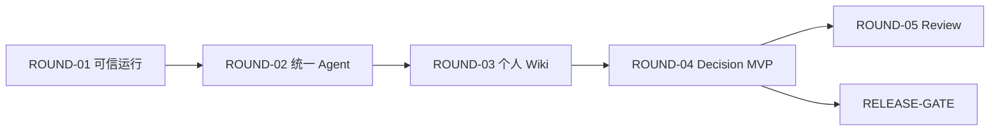

# 业务交付轮次

本目录把实现 Task 组织为可独立体验、完整验收和局部回滚的业务轮次。

Task 解决“这一小块代码是否正确”，Business Round 解决“这一阶段产品是否真的可用”。
依赖和 Task 状态仍以 [`tasks/BACKLOG.md`](../tasks/BACKLOG.md) 为准；本目录不复制
Task 实现契约。

## 状态

每个轮次文件使用：

```yaml
status: draft | ready | in_progress | acceptance | accepted | blocked
runtime_state: not_deployed | disabled | enabled | rolled_back
```

- `draft`：范围已记录但未获执行授权；
- `ready`：用户已授权本轮，基准、Task 和验收脚本已冻结；
- `in_progress`：正在逐个执行本轮 Task；
- `acceptance`：实现 Task 已接受，正在执行轮次级 E2E 和回滚演练；
- `accepted`：Codex 完整验收通过，形成稳定基线；
- `blocked`：缺少产品决定、权限、环境或存在无法继续的失败。

`status` 表示交付结论，`runtime_state` 表示部署时是否启用。已经 `accepted` 的轮次后来
关闭能力时，不改写历史验收结论，只更新部署/事故记录。

## 轮次总览

| 轮次 | 用户可感知结果 | Task | 完成后的产品台阶 |
|---|---|---|---|
| [ROUND-01](ROUND-01-reliable-runtime.md) | 完成、刷新、断线、取消、失败和 Citation 均可信 | TASK-002～007 | 可靠 Agent |
| [ROUND-02](ROUND-02-unified-agent.md) | 一个助手使用 Direct/Research/Fortune，并可查看 Runs | TASK-001、008～013、028 | 通用 Agent |
| [ROUND-03](ROUND-03-personal-wiki.md) | 保存个人信息、导入 Markdown、确认 AI 建议 | TASK-014～020 | 了解用户的 Agent |
| [ROUND-04](ROUND-04-decision-mvp.md) | 使用 Wiki 完成秋招 Decision 闭环 | TASK-021～024 | 能辅助决策的 Agent |
| [ROUND-05](ROUND-05-review-loop.md) | 根据实际结果复盘并确认新认识 | TASK-025～026 | 能持续复盘的 Agent |
| [RELEASE-GATE](RELEASE-GATE.md) | 非生产发布准备、停止条件和回滚材料 | TASK-027 | 可申请生产切换 |

依赖关系：



ROUND-05 是 P1，不是秋招最小 MVP 前置条件。RELEASE-GATE 可以在 ROUND-04 后准备，
但实际生产切换仍需用户另行明确授权。

## 每轮开始门禁

Codex 只能在以下条件全部满足后把轮次改为 `ready`：

- 用户明确授权当前轮次；
- 上游轮次已经 `accepted`；
- 当前轮次 Task 清单、依赖和顺序已复核；
- 第一个 Task 的 `base_commit` 已固定；
- 轮次完整用户旅程和失败场景已冻结；
- 能力控制、上一稳定基线和依赖闭包已明确；
- Migration 兼容策略和数据保留行为已明确；
- 回滚步骤、停止条件和成功判据已明确；
- 所需前端 Skills、测试环境和 E2E 账号可用。

用户授权一个轮次，不等于授权后续轮次、生产发布或破坏性数据操作。

## 轮次内执行

```text
用户授权当前轮次
→ Codex 冻结 Round 与第一个 Task
→ Grok 实现一个 ready Task
→ Grok 验证并写 Handoff
→ Codex Review / 当前边界最小 E2E
→ accepted 后准备下一个 Task
→ 本轮 Task 全部 accepted
→ Codex 执行轮次完整 E2E
→ 执行非生产回滚/重新启用演练
→ 记录 accepted commit 和证据
→ 停止，等待用户决定下一轮
```

同一业务轮次内也不允许 Grok 绕过 Review Gate 连续执行多个 Task。

## 完整轮次验收

轮次 `accepted` 必须同时满足：

- 本轮所有 Task 均为 `accepted`；
- 本轮主用户旅程通过 Browser / Computer Use；
- 正常、空、取消、失败、刷新和权限场景按本轮风险验证；
- 上一轮核心用户旅程没有回归；
- 新增能力可按计划关闭，关闭后上一轮仍可使用；
- 后端在能力关闭时拒绝新请求，不能只依赖前端隐藏；
- 新 Schema 保留时，上一轮行为仍可工作；
- 回滚后没有删除或伪造用户数据；
- 验收记录使用
  [`round-acceptance-template.md`](../templates/round-acceptance-template.md)；
- 用户决定是否进入下一轮。

## 局部回滚原则

默认优先级：

```text
服务端关闭当前能力
→ 切回上一 accepted 部署/提交
→ 当前轮代码回退
```

数据库 Down Migration、删表、删字段和删除用户数据不作为常规事故回滚。

回滚遵守依赖方向：

```text
可信 Runtime
→ 统一 Agent
→ 个人 Wiki
→ Decision
→ Review
```

- 上层可以独立关闭并保留下层；
- 关闭底层时必须同时关闭仍依赖它的全部上层；
- 只读历史展示可以在“新建能力关闭”后继续保留；
- 每个写能力需要幂等、审计和明确的停用行为；
- 观测后台可独立关闭，但不能在缺少等价诊断手段时继续扩大上线范围。

## 能力控制清单

以下是逻辑能力名，不提前限定必须使用环境变量、配置服务还是流量路由。具体实现由
对应 Task 在进入 `ready` 前冻结。

| 轮次 | 逻辑能力控制 | 关闭后的行为 |
|---|---|---|
| ROUND-01 | `runtime_protocol_mode=legacy|v1` | 返回上一稳定 Run 链路，不降级 Schema |
| ROUND-02 | `unified_agent_enabled` | 停止新统一路由，回到 ROUND-01 稳定入口 |
| ROUND-02 | `agent_observability_enabled` | 关闭内部入口，用户 Agent Runs 不受影响 |
| ROUND-03 | `personal_wiki_enabled` | 关闭 Wiki 新入口，保留已写入数据 |
| ROUND-03 | `wiki_context_injection_enabled` | Agent 不注入个人 Wiki，Wiki 本身仍可读写 |
| ROUND-03 | `wiki_proposal_write_enabled` | 停止接受新 Proposal，不删除既有 Revision |
| ROUND-04 | `decision_skill_enabled` | 停止新 Decision Run，保留 Wiki 和历史 Decision |
| ROUND-04 | `decision_write_enabled` | 历史只读，新 Draft/选择保存被服务端拒绝 |
| ROUND-05 | `review_skill_enabled` | 停止新 Review，Decision 与 Wiki 继续可用 |

若具体实现无法提供上述粒度，进入 `ready` 前必须在 Round 文件中说明替代机制、扩大
后的回滚范围和用户可接受的风险，不能由执行者静默简化。

如果现有 Task 的 `allowed_paths`、目标或验收标准不足以实现本轮能力控制，Codex
必须在 Task 仍为 `draft` 时修订它，或新增独立 Task；不能让 Grok 在执行中越界补
开关。

能力控制的统一语义：

- Go 计算产品级有效能力并向前端返回可公开结果；
- Python Skill `available` 只表示执行面就绪；
- 前端只负责入口和状态表达，不能决定用户是否有权调用；
- Product Run 创建时冻结能力、Skill、Workflow 和版本快照；
- 关闭能力默认拒绝新 Run 和新写入；
- 运行中请求是允许完成、请求取消还是强制停止，必须在该 Round 进入 `ready` 前
  明确；
- 可选能力配置缺失或未知时默认关闭；
- 新能力在生产默认关闭，启用生产流量仍需用户明确授权。

## 数据与兼容窗口

- Migration 使用 Expand–Migrate–Contract；
- 当前轮只做 Expand/Migrate，破坏性 Contract 单独排期；
- 关闭能力时保留 Wiki Revision、Decision、Review 和 Run 历史；
- 旧代码必须能在新 Schema 存在时安全工作；
- 兼容路径至少保留到下一个依赖轮次通过，或由专门清理 Task 证明可以删除；
- 回滚成功以业务行为和数据不变量为准，不以“数据库恢复成旧形状”为准。

## 稳定基线与分支

- 每个 Task 继续使用独立 Grok worktree/branch；
- Task `accepted` 后按既定流程进入稳定主线；
- 不建立一个持续数周的 `grok/all-tasks` 或 `grok/round-all` 分支；
- 每轮结束记录 `base_commit`、`accepted_commit`，可选创建稳定 Tag；
- 未经用户明确要求不自动 Commit、Tag、Push、部署或进入下一轮。
