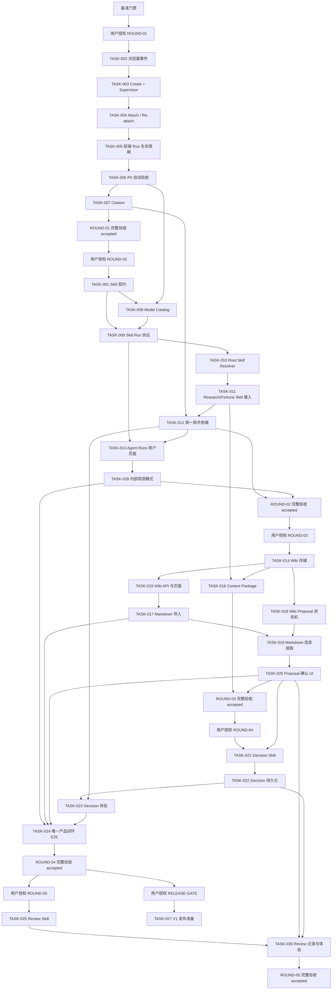

# 统一助手、Skill 与个人 Wiki 迁移 Backlog

> 版本：v0.1
>
> 状态：完整规划已沉淀；所有未轮到执行的 Task 保持 `draft`
>
> 最后更新：2026-07-30

## 1. 使用方式

本 Backlog 把
[`统一助手、Skill 与个人 Wiki 迁移实施方案`](../../docs/architecture/unified-agent-skill-migration-plan.md)
拆成可追踪 Task。业务轮次、完整验收和局部回滚见
[`业务交付轮次`](../rounds/README.md)。

规则：

1. 所有 Task 先沉淀目标、依赖、边界、历史 TODO 和验收语义；
2. `draft` 只表示规划存在，不允许执行；
3. Task 所属业务轮次必须已经获得用户授权；
4. 轮到执行前，Codex 必须根据最新主分支复核 Schema、路径、测试命令和依赖；
5. 复核后填写完整 `base_commit`，再改为 `ready`；
6. Grok 一次只执行一个需要 Review Gate 的 Task；
7. Codex 完成独立 Review 和规定的 Browser / Computer Use E2E 后才能接受；
8. 未来调整任务边界时保留原 ID 的审计关系，使用 `superseded` 指向替代 Task。

### 验收节奏

- 每个 Task 完成后立即由 Grok 验证、Codex Review，并在需要时执行当前边界的最小
  Browser / Computer Use E2E；
- 下游 Task 只能依赖已经 `accepted` 的上游 Task，不等待全部开发结束后再集中发现
  问题；
- 每个业务轮次结束后执行完整业务 E2E、上轮回归和局部回滚演练，但不为每个小 Task
  重复完整产品链路；
- TASK-024 负责完整 12 步秋招 MVP E2E，TASK-027 负责发布准备门禁。

### 前端页面 Skill 门禁

所有涉及前端页面、视觉组件、布局或用户交互的 Task 必须同时使用：

```text
frontend-design
ui-ux-pro-max
web-design-guidelines
```

Task 通过 `required_skills` 声明。缺少任意一个时保持 `blocked`，不得开始前端实现。

## 2. 基准门禁

开始 ROUND-01 的 TASK-002 前必须完成：

- 产品、架构、ADR、协作协议和本 Backlog 形成一个 Git 基准提交；
- 用户已有文档修改被明确纳入该提交；
- ROUND-01 和 TASK-002 的 `base_commit` 更新为完整 SHA；
- 从该 SHA 创建 TASK-002 对应 Grok worktree；
- 用户确认授权 ROUND-01。

该门禁不是 Grok 代码 Task，不授权自动提交或生产操作。

## 3. 依赖图



图中同时表达主要技术依赖和业务轮次门禁。每个 Task 文件中的 `depends_on` 是技术
依赖权威列表，Round 文件与用户授权是业务执行门禁；两者必须同时满足。

## 4. Task 清单

当前共 28 个 Task。TASK-028 是在最初 27 个 Task 冻结后新增的观测需求，因此保留
追加编号以维持审计关系；它的逻辑执行位置是 TASK-013 之后、TASK-024 之前，不按
编号大小决定执行顺序。

秋招最小 MVP 的实现与验收范围现在是 TASK-001～TASK-024 加 TASK-028；TASK-025～
TASK-026 仍是 P1，TASK-027 仍是发布准备而不是产品功能或生产切换。

| ID | 目标 | 里程碑 | 风险 | Codex E2E | 状态 |
|---|---|---|---|---|---|
| [TASK-001](TASK-001-skill-contract.md) | Skill Manifest 与 Registry | M1 | medium | N/A | draft |
| [TASK-002](TASK-002-browser-event-contract.md) | Activity 与正文结构化分离 | M2 | high | required | draft |
| [TASK-003](TASK-003-run-create-supervisor.md) | Create Run 与 Go Supervisor | M3 | high | required | draft |
| [TASK-004](TASK-004-run-event-attach.md) | Attach/Re-attach 与事件回放 | M3 | high | required | draft |
| [TASK-005](TASK-005-frontend-run-lifecycle.md) | 前端切换 Create/Attach/Cancel | M3 | high | required | draft |
| [TASK-006](TASK-006-p0-runtime-acceptance.md) | P0 故障注入与统一报告 | M4 | high | required | draft |
| [TASK-007](TASK-007-structured-citations.md) | Citation 投影、持久化与渲染 | M5 | high | required | draft |
| [TASK-008](TASK-008-model-catalog.md) | 稳定 Model Catalog 与 `model_id` | M6 | medium | N/A | draft |
| [TASK-009](TASK-009-skill-run-protocol.md) | requested/resolved Skill 跨服务协议 | M6 | high | required | draft |
| [TASK-010](TASK-010-root-skill-resolver.md) | Root Skill Resolver | M7 | high | required | draft |
| [TASK-011](TASK-011-existing-skill-integration.md) | Research/Fortune Skill 化 | M7 | high | required | draft |
| [TASK-012](TASK-012-unified-assistant-frontend.md) | 移除永久 Agent 模式并增加 Skill 交互 | M8 | high | required | draft |
| [TASK-013](TASK-013-agent-runs-page.md) | 用户侧 Agent Runs 最小页面 | M8 | medium | required | draft |
| [TASK-028](TASK-028-agent-observability-console.md) | Agent Runs 内部只读观测模式 | M8 | high | required | draft |
| [TASK-014](TASK-014-wiki-storage.md) | Wiki Item、Revision、Source 存储 | M9 | high | N/A | draft |
| [TASK-015](TASK-015-wiki-api-ui.md) | Wiki CRUD API 与页面 | M9 | high | required | draft |
| [TASK-016](TASK-016-context-package.md) | Context Package 与 ContextUsage | M9 | high | required | draft |
| [TASK-017](TASK-017-markdown-import.md) | 单篇 Markdown 保存与导入 | M10 | medium | required | draft |
| [TASK-018](TASK-018-wiki-proposal-state-machine.md) | Wiki Proposal 状态机 | M10 | high | required | draft |
| [TASK-019](TASK-019-markdown-extraction.md) | Markdown 候选信息提取 | M10 | high | required | draft |
| [TASK-020](TASK-020-proposal-confirmation-ui.md) | Proposal 接受、修改、暂缓与拒绝 | M10 | high | required | draft |
| [TASK-021](TASK-021-decision-skill.md) | Decision Skill 与强类型结果 | M11 | high | required | draft |
| [TASK-022](TASK-022-decision-persistence.md) | 最小决策卡与历史依据 | M11 | high | required | draft |
| [TASK-023](TASK-023-decision-experience.md) | Decision 对话与保存体验 | M11 | high | required | draft |
| [TASK-024](TASK-024-recruiting-mvp-e2e.md) | 秋招 MVP 唯一产品闭环 | M11 | high | required | draft |
| [TASK-025](TASK-025-review-skill.md) | Review Skill 与复盘 Proposal | Phase 4/P1 | medium | N/A | draft |
| [TASK-026](TASK-026-review-experience.md) | Review 记录、结果与确认体验 | Phase 4/P1 | high | required | draft |
| [TASK-027](TASK-027-v1-rollout-readiness.md) | V1 发布准备与人工门禁 | M12 | high | required | draft |

## 5. 业务交付轮次

技术 Task 不作为一次长程任务整体执行，而是按
[`collaboration/rounds/`](../rounds/README.md) 形成以下业务增量。

### ROUND-01：可信 Agent 运行链路

```text
TASK-002 ～ TASK-007
```

用户可以可信地完成、刷新、重新附着、取消和查看 Citation。本轮结束后执行 Runtime
故障、权限、旧链路回退和重新启用的完整验收。

### ROUND-02：统一 Agent、Skill 与观测

```text
TASK-001、TASK-008 ～ TASK-013、TASK-028
```

把普通/Research/Fortune 收敛到一个 Root Assistant，并完成统一前端、用户 Runs
页面和内部只读观测模式。

### ROUND-03：个人 Wiki、Markdown 与确认写入

```text
TASK-014 ～ TASK-020
```

实现用户拥有的长期信息、单篇 Markdown、上下文使用记录以及用户确认写入。

### ROUND-04：Decision 秋招 MVP 闭环

```text
TASK-021 ～ TASK-024
```

打通产品文档定义的 12 步唯一秋招 MVP 链路。

### ROUND-05：Review 复盘闭环

```text
TASK-025 ～ TASK-026
```

Review 属于 MVP 后续能力。TASK-027 是独立 RELEASE-GATE，只做发布准备和验证；
实际生产切换需要用户明确授权。

## 6. 延后但保留的 TODO

以下内容保留在产品/架构路线中，不在当前业务轮次内：

- [`Agent Core 未来扩展候选`](../../docs/architecture/agent-core-future-options.md)
  中记录的 ExecutionPlan、多 Skill、支持能力、通用 Bounded Action Loop、Run 内
  持久 HITL、高级上下文规划和 Eval 治理；这些内容均为未决候选，不代表已承诺实现；
- Agent 文档 CRUD、Document Changeset/Revision、删除确认与 Capability Guard；
  这是已确认的目标方向，但实现轮次尚未决定，且文档隐藏/恢复始终只允许用户手动；
- 模型选择器 UI 和多模型切换；
- 股票 Skill；
- Research 自适应 0/1/N 检索；
- Fortune 知识 Capability 和领域质量审核；
- Obsidian 单向或双向同步；
- Skill 改进 Proposal、自动版本和市场；
- CLI、外部 AI 授权和跨设备恢复；
- 写 Capability durable operation ledger；
- MCP、第三方 Skill 和 Draft Workflow；
- 大规模 Worker 池、跨地域调度、计费和多租户。

这些 TODO 不得被当前 Task 静默标记为完成。进入实施前必须新增或修订 Task。

## 7. 变更管理

未来发现当前拆分不合理时：

- 未执行的 `draft` Task 可以修改目标、依赖、范围和验收；
- 已经 `ready` 的 Task 修改前必须撤回到 `draft` 并重新固定基准；
- 已经产生 Handoff 的 Task 不重写历史，使用下一轮 Review 或新 Task；
- 被替换的 Task 标记 `superseded`，保留替代关系；
- `source_todos` 始终保留，确保原始 TODO 不因重新拆分而丢失。
