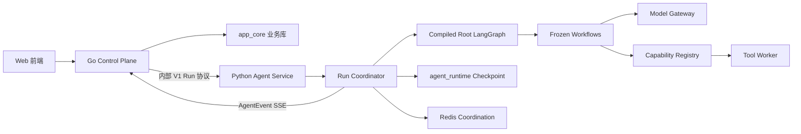
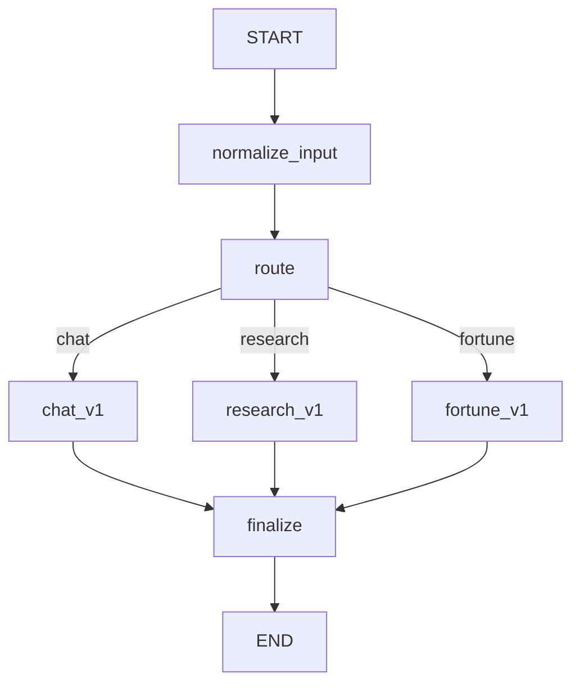
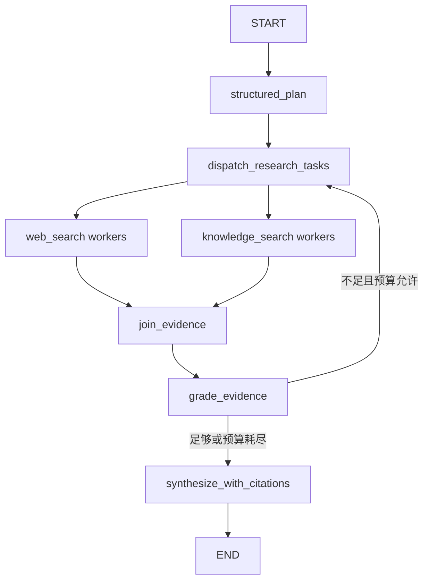

# 启点 Agent Runtime 目标架构

> 版本：v1.1
>
> 状态：已实现的 Agent Runtime 架构基线；生产启用等待人工审核
>
> 最后更新：2026-07-29
>
> 适用范围：Go Control Plane、Python Agent Service、Agent 工作流、模型、能力、运行状态与观测

## 0. 文档地位

本文档定义启点 Agent 下一阶段唯一的 Agent Runtime 目标架构。

- [`产品定位`](../product/positioning.md) 定义产品为什么存在、为谁服务和先做什么。
- 本文档定义 Agent Runtime 如何支撑该产品。
- [`Go/Python 迁移背景`](go-python-migration-history.md) 保留历史决策、协议设计和迁移背景；当其中的 Python
  内部执行路径与本文档冲突时，以本文档为准。
- [`迁移状态`](agent-runtime-migration-progress.md) 记录当前实现、验证结果、人工
  审核项和产品后续，不反向修改本文定义的目标边界。
- HTTP、数据库迁移和部署文档继续描述各自领域，但不得重新定义第二套 Agent
  编排路径。

本文档不是愿景展示图，而是代码迁移、评审、测试和删除旧代码时的共同基线。

## 1. 结论摘要

启点 Agent 保持以下长期边界：

```text
Go = 产品控制面与业务事实源
Python = Agent Runtime 与能力执行面
LangGraph = Python 内唯一工作流编排引擎
PostgreSQL = 业务事实和 Runtime Checkpoint 的持久化基础
Redis = 运行协调、取消、限流和短期缓存
```

本轮迁移只允许保留一条内部执行链：

```text
Legacy HTTP Adapter ─┐
                     ├─> Run Coordinator
V1 Agent Run API ────┘
                           ↓
                    Agent Application
                           ↓
                 Compiled Root StateGraph
                           ↓
          Chat / Research / Fortune Subgraph
                           ↓
        Model Gateway / Capability Registry
                           ↓
                 Runtime Event Mapper
                           ↓
                     V1 AgentEvent
```

以下情况在迁移结束后视为架构失败：

- Legacy 和 V1 分别执行不同的 Graph；
- 同时保留手写 `stream_graph` 循环与 compiled LangGraph；
- HTTP Handler 根据 Agent 名称直接调用节点；
- Workflow 节点直接创建 `ChatTongyi`、OpenAI Client 或读取 Provider Key；
- `agents.yaml` 声明的工具、轮次和超时与实际运行行为不一致；
- 节点手工拼装跨服务 Trace/Event；
- Python 写入 Go 所有的用户、会话、消息、决策或认知镜像业务表；
- 为兼容旧实现长期保留第二套 Router、Tool Router、RAG 或 Generate 路径。

## 2. 架构目标

### 2.1 当前目标

1. 把现有 default、research、fortune 行为迁入真正的 LangGraph 1.x。
2. Legacy 与 V1 复用完全相同的 Agent Application。
3. 使用百炼 OpenAI-compatible 接口建立 Provider 无关的 Model Gateway。
4. 使用强类型输入、输出和工具调用，删除 LLM 文本解析式控制协议。
5. 让 Agent 配置成为启动时校验且运行时真实生效的唯一配置源。
6. 将 Run、取消、deadline、checkpoint、事件和 Trace 收敛到 Runtime Kernel。
7. 保持 Go 已有 V1 Agent Run、事件持久化和可观测数据模型稳定。
8. 为产品后续的画像共建、决策实验室和结果复盘提供可插拔 Workflow 接口。

### 2.2 非目标

本轮不建设：

- 任意代码生成和执行；
- 通用 Agent OS；
- 不受限制的 Draft Workflow；
- 大规模多 Agent 社会模拟；
- 通用 Skill 市场；
- 完整 MCP 管理平台；
- Temporal 等独立持久工作流平台；
- 多地域 Agent 调度；
- 产品层完整认知镜像、决策和复盘功能。

这些能力可以在稳定接口上逐步增加，但不得阻塞当前 Runtime 收敛。

## 3. 核心原则

### 3.1 产品优先

架构首先服务 [`产品定位`](../product/positioning.md) 中的产品路线：

```text
命理与性格探索
→ 自我理解
→ 现实选择
→ 决策推演
→ 结果复盘
→ 持续更新的个人认知镜像
```

不为了展示“多 Agent”而增加 Agent。只有当一个能力拥有独立状态、工具、预算或
完成条件时，才把它建成独立 Workflow/Subgraph。

### 3.2 单一执行路径

同一个业务请求只能进入一个 Agent Application 和一个 Root Graph。

协议适配器可以不同，执行语义不能不同：

```text
Legacy Adapter:
LegacyRequest -> RunCommand -> Agent Application -> AgentEvent -> Legacy SSE

V1 Adapter:
AgentRunRequest -> RunCommand -> Agent Application -> AgentEvent -> V1 SSE
```

Legacy Adapter 只负责协议转换，不拥有 Agent 逻辑。

### 3.3 强类型边界

跨层数据使用 Pydantic Model、dataclass 或明确的 TypedDict：

- HTTP 请求/响应；
- RunCommand；
- Graph State；
- RouteDecision；
- Workflow 输入/输出；
- Tool 输入/输出；
- Artifact；
- Runtime Event；
- Agent 配置。

Prompt 文本不能充当内部控制协议。工具选择、出生信息、研究计划、完成条件和
Artifact 必须经过结构校验。

### 3.4 业务事实与运行状态分离

- Go 业务库保存用户可见、可修改、可删除的产品事实。
- Python Checkpoint 保存一次 Agent 执行的临时状态。
- 向量索引是派生数据，不是用户画像或产品事实源。
- Trace 是观测数据，不是用户画像。
- Chat History 是输入上下文，不等于已确认记忆。

### 3.5 确定性优先

能由代码确定的行为不交给 LLM：

- 参数校验；
- Agent/Workflow 是否存在；
- 工具权限；
- 预算；
- deadline；
- 图的依赖合法性；
- 出生日期格式；
- Run 状态转换；
- `done_when`；
- 用户是否已确认记忆。

LLM 负责理解、生成候选结构、解释和综合，不负责绕过 Runtime 规则。

### 3.6 可观测但默认最小采集

每次模型、工具、检索和 Workflow 调用都可追踪，但默认不保存完整敏感内容。
跨服务事件继续使用 hashed/off/sampled 采集级别和现有脱敏规则。

## 4. 系统上下文



### 4.1 Go Control Plane

Go 长期负责：

- 用户、认证、Session、CSRF 和公网安全；
- 会话、消息和可信 Chat History；
- Agent Run 业务记录；
- Agent Event、Span、Prompt 和 Usage 持久化；
- 产品领域数据；
- 用户操作授权；
- 提醒和长期任务触发；
- 浏览器 SSE 协议；
- 调用 Python、断线处理和最终状态对账。

Go 不负责：

- Prompt；
- LLM Provider 细节；
- Router 内部语义；
- GraphState；
- 工具选择；
- RAG 召回和生成；
- Python Workflow 节点。

### 4.2 Python Agent Service

Python 长期负责：

- Agent Workflow；
- 模型调用；
- Prompt；
- 工具与知识检索；
- Agent 运行时状态；
- 工作流 checkpoint；
- 运行级预算、deadline 和取消；
- 结构化 Agent Event 产生；
- Agent 内部观测与脱敏。

Python 不直接写入：

- 用户；
- 会话；
- 消息；
- 产品 Agent Run；
- 认知镜像；
- 决策卡片；
- 复盘；
- 提醒。

Python 只能通过稳定 AgentEvent 或 ArtifactProposal 把候选结果交给 Go。

## 5. 唯一请求链路

### 5.1 V1 主链路

```text
Go 创建业务 Run
→ POST /internal/v1/agent-runs:stream
→ V1 Handler 校验签名和请求
→ Run Coordinator 进行幂等声明
→ 创建 RunContext
→ Agent Application 选择 Root Graph
→ Root Graph 路由到 Frozen Workflow
→ Workflow 调用 Model/Capability
→ Graph Stream 转换为 RuntimeEvent
→ RuntimeEvent 映射为 V1 AgentEvent
→ SSE 返回 Go
→ Go 幂等持久化并投影业务状态
```

### 5.2 Legacy 兼容链路

```text
Go/旧客户端调用 /query_stream
→ Legacy Adapter 校验旧签名
→ 生成临时 execution_id/run_id/request_id
→ 转换为统一 RunCommand
→ 调用同一个 Run Coordinator 与 Root Graph
→ 消费同一种 AgentEvent
→ 只把 answer.delta、progress、terminal 映射为旧 SSE
```

Legacy 链路不得：

- 直接调用 `stream_graph`；
- 自己加载 `agents.yaml`；
- 自己决定 Router/Workflow；
- 自己产生模型或工具 Trace；
- 拥有独立缓存的 Agent 实例。

## 6. Runtime 分层

### 6.1 Protocol Adapter

职责：

- HTTP 和 SSE；
- 请求大小限制；
- HMAC、timestamp、nonce；
- Pydantic 校验；
- Legacy/V1 协议转换；
- 区分用户显式取消、浏览器 detached 和 Go/Python 内部流断开；
- 只有显式取消或 grace period 到期后的产品策略才能转换为 CancellationToken。

禁止：

- 调用 Graph 节点；
- 创建模型；
- 选择工具；
- 修改 GraphState；
- 拼 Prompt。

### 6.2 Run Coordinator

职责：

- execution_id 幂等；
- Run 状态机；
- deadline；
- 取消；
- 事件序号；
- Runtime execution record；
- 持久 Runtime Event Outbox；
- execution lease 与 fencing token；
- Checkpoint thread_id；
- 运行保留与清理；
- 并发额度；
- RuntimeEvent 发布；
- Graph 异常到稳定错误码的映射。

Run Coordinator 暴露稳定接口：

```python
class RunCoordinator(Protocol):
    async def start(self, command: RunCommand) -> RunHandle: ...
    async def stream(
        self,
        handle: RunHandle,
        starting_after: int = 0,
    ) -> AsyncIterator[AgentEvent]: ...
    async def snapshot(self, execution_id: str) -> RunSnapshot: ...
    async def cancel(self, execution_id: str) -> RunSnapshot: ...
```

### 6.3 Agent Application

Agent Application 是 Runtime 与 LangGraph 之间唯一入口：

```python
class AgentApplication(Protocol):
    async def stream(
        self,
        command: RunCommand,
        context: RunContext,
    ) -> AsyncIterator[RuntimeEvent]: ...
```

它负责：

- 构造 RootState；
- 为 Graph 注入 RunContext；
- 调用唯一 compiled Root Graph；
- 将 LangGraph stream part 转换为 RuntimeEvent；
- 不关心 HTTP 和 SSE 格式。

### 6.4 Root Graph

Root Graph 只负责：

1. 输入规范化；
2. RouteDecision；
3. 调用对应 Frozen Workflow；
4. 统一最终输出；
5. 运行结束验证。



### 6.5 Frozen Workflow

当前只实现三个版本化 Workflow：

- `chat_v1`
- `research_v1`
- `fortune_v1`

Workflow 通过统一接口接入 Root Graph：

```python
class WorkflowInput(BaseModel):
    query: str
    messages: list[ChatMessage]
    metadata: dict[str, JsonValue]


class WorkflowOutput(BaseModel):
    answer: str
    artifacts: list[ArtifactRef] = []
    citations: list[Citation] = []
    completion: CompletionResult
```

Workflow 不能读取 HTTP Request、Go 数据库连接或全局 Secret。

## 7. 当前三个 Workflow

### 7.1 Chat Workflow

目标：低延迟、低成本、无工具的普通对话。

```text
prepare_context
→ model_stream
→ finalize
```

规则：

- 不进入 Planner；
- 默认不调用工具；
- 不写长期记忆；
- 可产生“候选记忆建议”，但必须由未来产品流程确认；
- 支持上下文裁剪和摘要，但摘要不是产品事实。

### 7.2 Research Workflow

目标：基于证据完成开放式检索与分析。



规则：

- ResearchPlan 是结构化对象；
- fan-out 使用 LangGraph `Send`；
- Join 使用 reducer；
- 所有证据保留来源；
- 完成条件同时检查预算、证据数量和必需问题覆盖率；
- 不能使用字符串包含关系决定工具；
- `general_rag_agent` 不再是独立 Workflow，作为旧名称映射到 research；
- `deep_research` 不再是与 research 重复的黑箱 Tool，而是 Workflow 能力。

### 7.3 Fortune Workflow

目标：提供命理探索入口，同时保持不确定性和产品边界。

```text
extract_birth_profile
→ validate_required_fields
→ missing_fields ? interrupt/clarify
→ deterministic_chart_tools
→ optional_fortune_knowledge_retrieval
→ interpret_with_uncertainty
→ finalize
```

规则：

- `BirthProfile` 使用 Pydantic；
- 排盘由确定性工具完成，不由 LLM 猜测；
- 缺少必需字段时优先提问；
- 命理叙事必须与事实、用户陈述和 AI 推断区分；
- 不生成确定性人生预测；
- 命理知识检索是 Capability，不是第二个 Fortune Agent。

## 8. 未来产品 Workflow 扩展点

未来产品功能以新 Frozen Workflow 接入，不修改 Runtime Kernel：

- `profile_co_build_v1`
- `decision_lab_v1`
- `decision_review_v1`
- `import_extraction_v1`

Runtime 只需要识别新的 WorkflowSpec 和输入输出 schema。

未来如果需要 Draft Workflow，应遵守：

- 模型只生成 Plan IR；
- Plan IR 只能引用 Capability Registry 中已注册能力；
- 不能生成或执行 Python 源码；
- Runtime 校验依赖、循环、预算、权限和输出 schema；
- Draft 执行使用受限 Scheduler；
- 稳定且通过评测的 Draft 才能晋升为 Frozen Workflow。

## 9. Model Gateway

### 9.1 目标

Workflow 不绑定 DashScope、OpenAI SDK 或具体模型类。

```python
class ChatModel(Protocol):
    async def stream(
        self,
        request: ModelRequest,
        context: ModelContext,
    ) -> AsyncIterator[ModelStreamEvent]: ...

    async def structured(
        self,
        request: ModelRequest,
        output_type: type[OutputT],
        context: ModelContext,
    ) -> OutputT: ...
```

### 9.2 第一 Provider

第一实现使用：

```text
百炼 OpenAI-compatible Chat Completions
```

默认配置项：

- `MODEL_PROVIDER=dashscope_openai`
- `MODEL_BASE_URL`
- `DASHSCOPE_API_KEY`
- `LLM_MODEL_NAME`

生产环境优先使用百炼 Workspace 独享 Base URL。API Key 仍由 Python 容器持有，
不会注入 Go 和前端。

### 9.3 能力声明

模型配置必须显式声明并通过启动探测或契约测试验证：

```yaml
capabilities:
  streaming: true
  tool_calling: true
  parallel_tool_calls: true
  json_mode: true
  strict_json_schema: false
  stream_usage: true
```

Workflow 不能假设所有 OpenAI-compatible Provider 具备完全相同能力。

### 9.4 禁止节点创建 Client

以下写法在迁移后禁止出现在 Workflow：

```python
ChatTongyi(...)
ChatOpenAI(...)
AsyncOpenAI(...)
os.getenv("DASHSCOPE_API_KEY")
```

Client 只能在 Provider Adapter 中构造，并通过 RunContext 注入。

## 10. Agent 与 Workflow 配置

### 10.1 AgentSpec

`agents.yaml` 迁移为可验证的真实配置源：

```yaml
agents:
  - name: default_llm_agent
    workflow: chat_v1
    model_profile: default_chat
    prompt_bundle: chat_v1
    allowed_capabilities: []
    budgets:
      deadline_seconds: 60
      max_model_calls: 2
      max_tool_calls: 0

  - name: research_agent
    workflow: research_v1
    model_profile: default_reasoning
    prompt_bundle: research_v1
    allowed_capabilities:
      - web_search
      - knowledge_search
    budgets:
      deadline_seconds: 180
      max_model_calls: 10
      max_tool_calls: 16

  - name: fortune_agent
    workflow: fortune_v1
    model_profile: default_reasoning
    prompt_bundle: fortune_v1
    allowed_capabilities:
      - current_date
      - lunar_chart
      - ziwei_chart
      - fortune_knowledge_search
    budgets:
      deadline_seconds: 180
      max_model_calls: 8
      max_tool_calls: 8
```

### 10.2 启动校验

Python readiness 必须验证：

- Agent 名称唯一；
- Workflow 已注册；
- Prompt Bundle 存在；
- Model Profile 存在；
- Capability 已注册；
- Capability 允许当前 Agent 使用；
- Tool 输入输出 schema 可生成；
- deadline 和预算有有限上界；
- destructive Capability 不允许 shadow；
- Prompt hash 可计算；
- Graph 可编译。

失败时 readiness 返回失败，不能等到用户请求才暴露配置错误。

### 10.3 兼容别名

旧名称只在 Alias Registry 中维护：

```text
default -> default_llm_agent
research -> research_agent
fortune -> fortune_agent
general_rag_agent -> research_agent
```

代码中禁止散落 `if agent_name in {...}`。

## 11. Capability Registry

### 11.1 统一能力模型

当前 Tool Registry 演进为 Capability Registry：

```python
class CapabilitySpec(BaseModel):
    name: str
    version: str
    kind: Literal["tool", "knowledge", "service", "mcp", "skill"]
    effect: Literal["read", "write", "destructive"]
    idempotent: bool
    shadow_allowed: bool
    timeout_seconds: int
    max_input_bytes: int
    max_output_bytes: int
    concurrency_class: Literal["async", "thread", "worker"]
    input_schema: type[BaseModel]
    output_schema: type[BaseModel]
```

本轮只必须实现：

- tool；
- knowledge。

service、MCP、skill 只保留接口，不提前实现平台。

### 11.2 Capability Executor

Capability Executor 统一处理：

- Agent 白名单；
- shadow；
- Pydantic 输入校验；
- deadline；
- 重试；
- 幂等键；
- 并发限制；
- 取消；
- 输出大小；
- Trace；
- 错误标准化。

Workflow 不能绕过 Executor 直接导入 Tool Handler。

### 11.3 执行分类

```text
async:
  原生异步、可取消的网络调用

thread:
  短时间同步库调用；超时只停止等待，底层线程未必立即停止

worker:
  CPU、高内存、文档解析、Pandas、索引等重任务
```

生产 Worker 使用常驻 Worker 池。当前 per-call multiprocessing 只作为迁移期实现。

## 12. Graph State 与 Context

### 12.1 RootState

RootState 只保存工作流需要的可序列化状态：

```python
class RootState(TypedDict):
    command: RunCommandData
    route: RouteDecision | None
    workflow_input: dict
    workflow_output: dict | None
    completion: CompletionResult | None
    error: RuntimeErrorInfo | None
```

禁止放入：

- API Key；
- 数据库连接；
- HTTP Request；
- asyncio Task/Event；
- 模型 Client；
- 不可序列化对象；
- 完整用户业务对象。

### 12.2 RunContext

不可持久化的依赖通过 LangGraph Runtime Context 注入：

```python
@dataclass
class RunContext:
    execution_id: str
    run_id: str
    request_id: str
    user_id: str
    deadline: datetime
    shadow: bool
    cancellation: CancellationToken
    models: ModelGateway
    capabilities: CapabilityExecutor
    events: RuntimeEventSink
    budgets: RunBudget
```

### 12.3 Workflow 私有状态

各 Subgraph 使用独立 schema。Root Graph 不复制 ResearchPlan、BirthProfile 或未来
DecisionAnalysis 的内部字段。

## 13. 持久化与状态所有权

### 13.1 Go 业务 schema

`app_core` 继续由 Go 独占写入：

- users；
- sessions；
- conversations；
- messages；
- agent_runs；
- agent_run_events；
- agent_run_spans；
- prompt_artifacts；
- 未来产品领域表。

### 13.2 Python Runtime schema

Python 使用独立 schema 或独立数据库账号：

```text
agent_runtime
├── runtime_executions
├── runtime_events
├── LangGraph checkpoints
├── checkpoint writes
└── Runtime artifact staging metadata（如需要）
```

Checkpointer 的 `thread_id` 使用 `execution_id`，而不是把整个用户会话作为永久
Agent Memory。Go 每次提供可信 Chat History。

`runtime_executions` 是 Python 的运行协调记录，至少保存：

- execution_id、run_id 和幂等请求摘要；
- Runtime 状态、deadline 和 last_sequence；
- owner_id、lease_epoch 和 lease_expires_at；
- Graph/Workflow 版本；
- 创建、开始、完成和清理时间。

`runtime_events` 是短期持久 Runtime Event Outbox。Run Coordinator 必须先按
`execution_id + sequence` 持久写入事件，再允许 SSE 发布。它是 Python
`starting_after` 的跨进程、跨副本回放来源，不是用户长期业务历史。

Go 的 `app_core.agent_run_events` 仍是产品侧长期事件事实源。Go 接收 Python 事件后
继续幂等持久化；Python Outbox 在 Run terminal 且超过运维保留期后清理。两者职责
不同，不允许依赖 Redis 替代任一持久记录。

多副本通过 PostgreSQL 原子 lease 和单调递增 `lease_epoch` 获得执行所有权。执行
副本在写 Checkpoint、Runtime Event 或执行带副作用 Capability 前必须校验 fencing
token。Redis 可以用于通知和降低竞争，但不决定最终所有权。

恢复规则：

1. 已存在 execution_id 且请求摘要不同，返回幂等冲突；
2. 已存在且 lease 有效，续接同一执行并从 Outbox 回放；
3. lease 过期后，新副本使用更高 lease_epoch 接管并从 Checkpoint 恢复；
4. 无法证明副作用可安全恢复时，发布 `runtime_recovery_failed` 并失败关闭；
5. 禁止为了“继续运行”从头盲目重跑非幂等 Tool。

### 13.3 Redis

Redis 用于：

- cancellation broadcast；
- execution lease/短锁；
- concurrency semaphore；
- rate limit；
- 短期 Tool Cache；
- Worker Queue；
- 临时事件通知。

Redis 不作为唯一 Run 历史或用户记忆事实源。

### 13.4 Artifact

Runtime 定义统一引用：

```python
class ArtifactRef(BaseModel):
    artifact_id: str
    artifact_type: str
    schema_version: int
    content_hash: str
    media_type: str
    size_bytes: int
```

当前阶段可只返回内联小型 Artifact。未来大对象保存到对象存储，Go 保存业务关联。

## 14. Event、Trace 与 Usage

### 14.1 稳定事件

V1 事件语义保持稳定：

- `run.started`
- `route.selected`
- `progress`
- `prompt.used`
- `model.started/completed/failed`
- `tool.started/completed/failed`
- `retrieval.started/completed/failed`
- `answer.delta`
- `artifact.created`
- `usage`
- `run.completed/cancelled/failed/timed_out`

LangGraph 节点名不是跨服务协议。重命名节点不得破坏事件语义。

### 14.2 自动采集位置

Trace 在以下边界自动产生：

- Run Coordinator；
- Model Gateway；
- Capability Executor；
- Retrieval Adapter；
- Workflow/Subgraph 边界；
- Checkpointer；
- Event Mapper。

Workflow 节点不得手工维护 `model_traces`、`tool_traces` 或已发送索引。

### 14.3 双通道观测

```text
内部详细观测 -> OpenTelemetry-compatible Span
跨服务业务观测 -> 脱敏 V1 AgentEvent -> Go PostgreSQL
```

默认不持久化模型隐式思维链，不把完整敏感 Prompt/Tool 内容写入事件。

### 14.4 Usage

Model Gateway 统一归一化：

- input_tokens；
- output_tokens；
- cached_tokens；
- reasoning_tokens（Provider 提供时）；
- total_tokens；
- first_token_ms；
- total_duration_ms；
- model_call_count；
- tool_call_count；
- retrieval_count；
- Provider 和模型版本。

### 14.5 Run Provenance

每次 Run 在执行所选 Workflow 前生成并封存不可变 `RunProvenance`：

```python
class RunProvenance(BaseModel):
    runtime_version: str
    graph_version: str
    workflow_name: str
    workflow_version: str
    agent_spec_hash: str
    prompt_bundle_hashes: dict[str, str]
    model_profile: str
    model_provider: str
    model_name: str
    model_revision: str | None
    capability_versions: dict[str, str]
```

`run.started` 携带 Runtime、Root Graph 和 AgentSpec 等路由前即可确定的摘要。
Root Graph 选定 Workflow 后，`route.selected` 携带完整 Provenance，并且必须发生
在第一次 Workflow 模型、检索或 Tool 副作用之前。`prompt.used` 记录实际调用使用
的 Prompt hash。Go 将需要长期查询的字段投影到 Run、Prompt Artifact 和 Span。
Provenance 封存后不允许因为热更新配置而改变；新配置只影响新 Run。

## 15. 取消、超时、重试与幂等

### 15.1 取消链

断开传输连接不等于用户表达了取消意图。必须区分：

```text
用户显式点击停止
→ Go 发起 Cancel
→ DELETE Python Execution
→ Run Coordinator 设置 CancellationToken
→ LangGraph 停止调度后续节点
→ Model Gateway 取消网络流
→ Capability Executor 取消工具
→ Worker 终止或撤销任务
→ 发布 run.cancelled
```

```text
浏览器 SSE 意外断开
→ Go 将客户端标记为 detached
→ 不立即把 Run 解释为 cancelled
→ 在可配置 grace period 内允许按已确认游标重新附着
→ grace period 到期后按产品策略继续后台完成或发起 Cancel
```

```text
Go ↔ Python 内部事件流断开或发现 sequence gap
→ Go 保留已确认 last_sequence
→ 使用同一 execution_id 和 starting_after 重连
→ Python 先从持久 Runtime Event Outbox 回放
→ 回放追平后继续消费实时事件
→ 超过重连预算则最终状态对账并失败关闭
```

MVP 默认策略为：用户显式停止立即取消；浏览器意外断开提供短暂 grace period；
Go/Python 内部断线优先续接而不是取消。具体 grace period 由 Go 产品配置控制，
不得由 LangGraph 节点决定。

### 15.2 Deadline

deadline 是绝对时间并贯穿所有层。子调用超时不能超过剩余 deadline。

### 15.3 重试

只重试明确可重试的调用：

- 模型限流、短暂网络错误；
- 幂等 read Tool；
- 可恢复的检索；
- Checkpoint 冲突。

不自动重试：

- destructive Tool；
- 用户输入校验失败；
- 权限拒绝；
- 已超预算；
- 非幂等副作用；
- 明确内容安全拒绝。

### 15.4 幂等

- Run：`execution_id + idempotency_key`
- Event：`execution_id + sequence`
- Tool：`execution_id + capability + call_id`
- Artifact：内容 hash 或显式 artifact id

可恢复任务中的副作用必须可查询既有结果或使用幂等键。

## 16. 安全与隐私

### 16.1 网络

- Go 是唯一公网入口；
- Python、PostgreSQL、Redis 和 Worker 不暴露公网；
- 生产环境不发布 Python 宿主机端口；
- 内部请求继续使用 HMAC，跨主机部署后可增加 mTLS。

### 16.2 Secret

- Provider Key 只注入 Python；
- Go 只持有内部服务密钥和业务数据库凭据；
- Secret 不进入 GraphState、Event、Checkpoint、Prompt hash metadata；
- 日志和 Trace 继续执行防御性脱敏。

### 16.3 用户记忆

未来产品中：

- AI 只能提出记忆候选；
- 用户确认后才成为业务事实；
- Checkpoint 不等于已确认记忆；
- 用户删除业务记忆时必须清理派生索引、缓存和允许删除的采样内容；
- 事实、用户陈述、AI 推断和命理叙事必须有不同类型。

## 17. 目标目录

迁移完成后的职责目录：

```text
backend/
├── app/
│   ├── main.py
│   ├── api/
│   │   ├── graph_routes.py        # Legacy，仅协议适配
│   │   ├── agent_runs.py          # V1 协议
│   │   └── internal_auth.py
│   ├── observability/
│   │   ├── redaction.py
│   │   └── traces.py
│   └── runtime/
│       ├── registry.py             # 唯一 Run Coordinator
│       ├── langgraph_v1.py
│       ├── store.py
│       ├── postgres_store.py
│       ├── checkpointer.py
│       ├── coordination.py
│       ├── factory.py
│       └── models.py
├── agent/
│   ├── application.py             # Runtime 到 Root Graph 的唯一入口
│   ├── state.py
│   ├── graph.py                   # 唯一 Root Graph Builder
│   ├── specs.py
│   ├── context.py
│   ├── capabilities.py
│   ├── artifacts.py
│   ├── events.py
│   ├── readiness.py
│   ├── workflows/
│   │   ├── chat_v1/
│   │   ├── research_v1/
│   │   └── fortune_v1/
│   ├── tools/
│   │   ├── registry.py
│   │   ├── date.py
│   │   ├── lunar_chart.py
│   │   └── ziwei_chart.py
│   ├── models/
│   │   ├── gateway.py
│   │   └── providers/
│   │       └── dashscope_openai.py
│   └── prompts/
├── configs/
│   └── agents.yaml
├── scripts/
│   └── setup_agent_runtime.py
└── tests/
    ├── unit/
    └── integration/
```

可以分阶段移动文件，但迁移结束后不得继续保留顶层 `graph/` 作为第二套执行实现。

## 18. 启动生命周期

Python 启动时按顺序完成：

1. 加载 Settings；
2. 校验 Secret 和环境；
3. 校验 Runtime schema、Event Outbox 和 lease 能力；
4. 加载 Model Profiles；
5. 构造 Model Gateway；
6. 注册 Capability；
7. 加载并校验 AgentSpec；
8. 构建 Frozen Workflows；
9. 构建唯一 Root Graph；
10. 使用生产 Checkpointer 编译；
11. 构造 Agent Application；
12. 构造 Run Coordinator；
13. 执行最小自检；
14. readiness 变为 ready。

禁止请求首次到达时才懒加载并编译全局 Graph、下载大型模型或发现配置错误。
大型知识索引可以延迟加载，但 readiness 必须能说明其能力状态。

## 19. 迁移阶段

### Phase 0：行为基线

目标：先记录当前对外行为，避免重构中无法判断是否回归。

交付：

- Legacy SSE 契约测试；
- V1 Event 契约测试；
- default/research/fortune 路由样例；
- Mock Model；
- Mock Tool；
- 用户停止、浏览器 detached、内部断线、超时样例；
- 当前 Prompt hash 基线；
- 当前 AgentSpec、Workflow、Prompt 和模型版本基线；
- 当前生产容器的 Python、LangGraph、LangChain、OpenAI SDK 和 Pydantic 版本快照；
- 明确迁移后的唯一依赖锁定来源，并单独生成 LangGraph 1.x 目标依赖环境；
- 当前测试全部通过。

验收：

- 不需要真实 Provider 即可测试完整 Graph；
- 关键 SSE/Event fixture 可重复回放；
- 浏览器断开不会被测试代码含糊地等同为用户显式停止；
- 当前生产基线环境与 LangGraph 1.x 目标环境可分别重复创建，测试结果不混用；
- 本地、CI 和容器不得各自解析出未记录的依赖版本；
- 工作树没有未解释的生成文件。

### Phase 1：Model Gateway

目标：先隔离 Provider，不改变 Workflow 行为。

交付：

- `ModelGateway` Protocol；
- 百炼 OpenAI-compatible Provider；
- streaming、tools、JSON Mode、Usage 契约测试；
- Provider capability matrix；
- 节点不再读取 API Key；
- 当前 `ChatTongyi` 调用逐步迁移。

验收：

- 可用 FakeModel 跑所有单元测试；
- 切换模型只改配置；
- Provider 错误映射为稳定 RuntimeError；
- 不泄露 API Key。

### Phase 2：唯一 compiled LangGraph

目标：消除手写编排与 Builder 双轨。

交付：

- RootState；
- Root Graph；
- `chat_v1`；
- `research_v1`；
- `fortune_v1`；
- Agent Application；
- 固定并验证 LangGraph 1.x 目标版本；
- Legacy/V1 同时调用 Agent Application。

验收：

- 生产请求不再调用旧 `stream_graph`；
- 只有 Agent Graph Assembly 层可以调用 `.compile()`；HTTP、Runtime 和请求路径
  不得临时编译 Graph；
- HTTP Handler 不导入 Graph 节点；
- Legacy 与 V1 对相同输入选择同一个 Route/Workflow；
- 原有协议测试继续通过。

### Phase 3：强类型配置与 Capability

目标：配置、工具和实际行为一致。

交付：

- AgentSpec；
- ModelProfile；
- Alias Registry；
- CapabilitySpec；
- Capability Executor；
- 结构化 RouteDecision、ResearchPlan、BirthProfile；
- Agent 工具白名单与预算真实生效。

验收：

- 配置引用不存在的 Tool 时 readiness 失败；
- research 不能调用 fortune 未授权能力；
- shadow 不能调用不允许的能力；
- 不再解析 LLM 返回的工具名称字符串；
- YAML 中不保留无效字段。

### Phase 4：统一观测与 Checkpoint

目标：让 Runtime 可恢复、可审计，同时删除节点内观测状态。

交付：

- PostgreSQL Checkpointer；
- `runtime_executions`；
- 持久 Runtime Event Outbox；
- PostgreSQL execution lease 与 fencing token；
- RuntimeEvent Sink；
- Model/Tool/Retrieval Middleware；
- 自动 Usage；
- 断线 `starting_after`；
- checkpoint retention；
- checkpoint 清理任务。

验收：

- Python 进程重启后能识别已有执行并给出一致状态；
- 同一 execution_id 不重复创建执行；
- Run 事件可跨进程、跨副本从 starting_after 连续回放；
- 旧副本失去 lease 后不能继续写 Checkpoint、事件或执行副作用；
- 并行节点失败后不重复运行已成功的幂等任务；
- 非幂等副作用无法安全恢复时失败关闭，不从头盲目重跑；
- 节点中不存在 `append_model_trace` 一类手工跨服务事件逻辑；
- Go 现有事件/Span 查询仍然可用。

### Phase 5：V1 灰度与旧代码清理

目标：V1 成为默认内部协议，Legacy 只保留薄适配器。

Phase 4 验收完成前，V1 只用于本地集成测试、单副本验证和受控 shadow，不得成为
生产默认协议，也不得宣称具备跨进程恢复能力。

交付：

- 开发环境默认 V1；
- shadow/canary 对比；
- 生产灰度开关；
- 回滚手册；
- 删除旧 Graph、旧 Router/Tool Router/RAG 死代码；
- README 和部署文档更新。

验收：

- 默认流量只经过唯一 Agent Application；
- 生产默认 V1 前已通过进程重启、跨副本接管和 Outbox 回放测试；
- Legacy Adapter 文件不含 Agent 逻辑；
- 删除旧代码后全部测试通过；
- 无未使用 Prompt、Tool、配置和依赖；
- 架构扫描测试禁止旧模块被重新导入。

### Phase 6：产品 Workflow

完成 Runtime 收敛后，再按产品优先级增加：

1. `profile_co_build_v1`
2. `decision_lab_v1`
3. `decision_review_v1`
4. `import_extraction_v1`

产品 Workflow 必须复用既有 Runtime、Model Gateway、Capability、Event 和
Checkpoint，不能创建新的执行框架。

## 20. 旧代码清理清单

迁移结束时必须逐项判断删除或迁移：

- `backend/graph/__init__.py` 中手写 `stream_graph`；
- `backend/graph/builder.py` 的旧 Graph；
- 旧 `direct_llm.py`；
- 未接入主链的 `tool_router.py`；
- 未接入主链的 `tools_exec.py`；
- 旧 `rag.py`、`retrieval.py`、`generation.py` 重复实现；
- `graph_routes.py` 中 Agent cache/config loader；
- `agent_factory.py` 兼容包装；
- `rag/pipelines/rag_pipeline.py` 的第二套 Agent cache；
- 节点内 `ChatTongyi` 构造；
- 节点内 Prompt/Tool/Model Trace 数组；
- `agents.yaml` 无效字段；
- 与新 Provider 重复的 DashScope 依赖；
- 不再被调用的 Prompt；
- 只为旧路径存在的测试和脚本。

删除遵循：

1. 新路径达到行为和契约测试；
2. 搜索确认没有运行时引用；
3. 删除代码；
4. 删除依赖和配置；
5. 更新文档；
6. 完整测试；
7. 不保留“以后可能有用”的第二套实现。

## 21. 测试与评测

### 21.1 单元测试

- RouteDecision；
- AgentSpec 校验；
- Alias；
- Capability 权限；
- Budget；
- State Transition；
- Event Mapper；
- Redaction；
- Model Provider 响应归一化；
- Structured Output 重试；
- Artifact schema。

### 21.2 Graph 测试

- 每个 Workflow 使用 FakeModel/FakeTool；
- 每条条件边；
- 空结果；
- Tool 失败；
- 模型失败；
- deadline；
- cancel；
- checkpoint resume；
- 进程终止后的 checkpoint resume；
- lease 过期后的跨副本接管；
- 旧 lease_epoch 写入被 fencing；
- 非幂等副作用恢复时失败关闭；
- 并行 Join；
- 最大循环次数；
- `done_when`。

### 21.3 契约测试

- Go/Python V1 fixture 双向一致；
- Legacy SSE 保持兼容；
- Event sequence 连续；
- Usage 字段；
- Prompt hash；
- 错误码；
- 浏览器 detached 与显式取消语义；
- Go/Python 内部断线重连；
- 跨进程、跨副本 starting_after 事件回放。

### 21.4 Eval

初期至少建立：

- 路由准确率；
- Research 引用完整性；
- Tool 选择正确率；
- BirthProfile 提取正确率；
- Fortune 不确定性表达；
- 无工具 Chat 延迟；
- 成本和 Token；
- 用户停止后的资源释放。

后续产品 Eval：

- 画像候选是否有证据；
- 是否把推断误写为事实；
- 决策分析是否覆盖约束、反例和缺失事实；
- 是否保持用户自主性；
- 复盘是否根据真实反馈校准，而不是维护旧结论。

## 22. Definition of Done

只有全部满足，才能宣布本轮“Agent Runtime 架构迁移完成”：

### 执行

- 一个 Root Graph；
- 一个 Agent Application；
- 一个 Run Coordinator；
- Legacy/V1 复用同一执行链；
- Chat/Research/Fortune 是独立 Subgraph；
- 没有手写第二循环。

### 配置

- AgentSpec 真实生效；
- 模型、Prompt、工具、预算和超时可追溯；
- 无失效配置；
- readiness 能发现错误。

### 模型与能力

- Workflow 不依赖具体 Provider；
- 工具输入输出强类型；
- Agent 工具白名单有效；
- Tool 统一经过 Capability Executor。

### 可靠性

- deadline、取消、幂等、重连可测试；
- Checkpoint 使用持久后端；
- Runtime Event Outbox 支持跨进程回放；
- Python 重启不会静默遗忘 Run；
- 多副本使用 lease_epoch fencing，即使暂时只运行一个副本。

### 观测

- 模型、工具、检索、Prompt、Usage 自动采集；
- Event schema 稳定；
- Run Provenance 可查询且在执行期间不可变；
- 无敏感 Secret；
- Go 查询继续可用。

### 清理

- 旧 Graph 与无效节点删除；
- 旧依赖删除；
- 旧配置删除；
- 文档更新；
- 没有“新旧两套先都留着”的长期状态。

## 23. 未来扩展保证

未来扩展性由以下稳定接口保证，而不是预先实现所有功能：

1. `AgentApplication`
2. `WorkflowInput/WorkflowOutput`
3. `AgentSpec/WorkflowSpec`
4. `CapabilitySpec`
5. `ModelGateway`
6. `ArtifactRef`
7. `RuntimeEvent/AgentEvent`
8. `RunContext`
9. `Plan IR`（未来启用）

基于这些接口，未来可以增加：

- 认知镜像 Workflow；
- 决策实验室；
- 复盘；
- RAG；
- MCP；
- Skill；
- 新模型；
- 新 Provider；
- Ready-Wave 动态并行；
- 受限 Draft Workflow；
- 人工确认；
- 多副本和 Worker 扩容。

这些扩展不得改变 Go/Python 的状态所有权，也不得建立第二个 Runtime。

## 24. 架构决策记录

### ADR-001：保留 Go + Python 双栈

Go 擅长业务控制面，Python 擅长 Agent 和 AI 生态。双栈是长期架构，不是临时债务。

### ADR-002：LangGraph 是唯一 Python 编排引擎

不再同时维护手写 Graph 循环。需要动态行为时使用 Subgraph、Send、Command、
Interrupt 和受限 Plan IR。

### ADR-003：V1 Runtime 与 Trace 保留

V1 Runtime 是跨服务稳定外壳，不因内部 Graph 重构而删除。Trace 数据模型保留，
采集方式迁移到 Middleware/Adapter。

### ADR-004：百炼使用 OpenAI-compatible Provider

以标准接口降低 Provider 耦合，同时保留百炼扩展参数和原生接口作为明确的 Provider
能力，不把兼容接口误认为所有模型完全等价。

### ADR-005：产品记忆不存 LangGraph Checkpoint

Checkpoint 保存执行状态。用户可见、可改、可忘的认知镜像由 Go 产品业务表管理，
并经过用户确认。

### ADR-006：先 Frozen Workflow，后 Draft Workflow

当前以 Chat、Research、Fortune 和后续产品 Workflow 为主。只有出现足够多未知、
跨能力任务并有评测和安全需求时，才启用受限 Draft Workflow。

### ADR-007：不保留第二套架构

兼容通过 Adapter、Alias 和 Event Mapper 完成，不通过复制执行逻辑完成。迁移完成
后删除旧实现是交付的一部分。

### ADR-008：Python 使用短期持久 Event Outbox 支撑 V1 回放

Go 持有产品侧长期 Agent Event 事实；Python 持有带有限保留期的 Runtime Event
Outbox，负责 `starting_after` 的跨进程和跨副本回放。Redis 只做通知，不能作为
唯一事件来源。

### ADR-009：传输断开与语义取消分离

用户显式停止才直接表达取消意图。浏览器意外断开先进入 detached/grace period；
Go/Python 内部断线按相同 execution_id 和已确认 sequence 续接。是否在 grace
period 后继续后台完成由 Go 产品策略决定。
