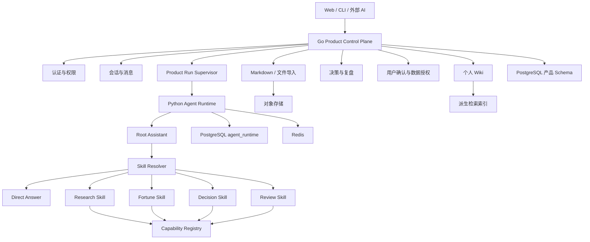

# 启点统一助手与 Skill 目标架构

> 版本：v0.1
>
> 状态：目标架构草案；用于后续 Task 设计，不代表当前代码已经实现
>
> 最后更新：2026-07-30

## 0. 文档地位

本文定义启点从“多个 Agent 模式”演进为“一个统一助手、多种 Skill”的目标架构。

- [`产品定位`](../product/positioning.md) 定义产品核心价值；
- [`完整产品蓝图`](../product/future-product.md) 定义长期产品形态；
- [`Web MVP`](../product/web-mvp.md) 定义完整 Web 阶段；
- [`秋招最小 MVP`](../product/recruiting-mvp.md) 定义当前交付范围；
- [`Agent Runtime`](agent-runtime.md) 继续定义现有 Go/Python Runtime 可靠性基线；
- [`迁移实施方案`](unified-agent-skill-migration-plan.md) 定义历史 TODO 追溯、当前
  代码起点、实施顺序和验收门禁。

本文扩展现有 Runtime，不替换或复制它。发生冲突时：

1. 产品范围由产品文档决定；
2. Runtime 状态、恢复和数据所有权由 `agent-runtime.md` 决定；
3. 统一助手、Skill、个人上下文和 Human-in-the-loop 由本文决定。

## 1. 架构结论

启点的目标形态是：

```text
一个用户可感知的启点助手
→ 直接回答，或解析最多一个主 Skill
→ Skill 进入受控、版本化 Workflow
→ Workflow 只能调用已注册 Capability
→ 使用经过授权和筛选的个人上下文
→ 返回答案、Artifact 与更新建议
→ 只有用户确认后才更新个人 Wiki
```

长期边界：

```text
Go = 产品控制面、个人 Wiki 和长期业务事实
Python = Root Assistant、Skill Workflow 和 Capability 执行面
PostgreSQL = 产品事实与 Runtime 持久化基础
Redis = 通知、协调、限流和短缓存
对象存储 = Markdown、导入文件和大型 Artifact
派生索引 = 可重建的个人上下文检索结构，不是事实源
```

## 2. 核心原则

### 2.1 用户只面对一个助手

前端不再要求用户选择 `default_llm_agent`、`research_agent` 或
`fortune_agent`。这些名称只在兼容层中存在。

用户可以：

- 直接描述问题，由助手解析主 Skill；
- 通过 `/decision`、`/fortune` 等显式指定 Skill；
- 在中等置信度时确认是否使用建议的 Skill；
- 看见本次实际使用了哪个 Skill、哪些个人信息和哪些工具。

### 2.2 Skill 不是新身份

Skill 是一次 Run 中采用的专业能力和工作方式，不拥有独立用户身份、独立记忆或
独立产品事实源。

Research、Fortune、Decision、Review 等 Skill 共享：

- 同一个用户；
- 同一套会话；
- 同一份个人 Wiki；
- 同一个 Product Run；
- 同一个 Agent Runtime；
- 同一个 Capability Registry；
- 同一套事件、Artifact 和 provenance。

### 2.3 Workflow 与 Capability 分离

- Skill：用户可理解的专业能力；
- Workflow：Skill 背后的受控执行图；
- Capability：搜索、排盘、文档解析等原子动作。

`fortune` Skill 可以使用 `fortune_v1` Workflow；Workflow 再调用
`get_lunar_chart` 和 `get_ziwei_chart` Capability。不能把排盘工具直接包装成第二个
Agent。

### 2.4 个人上下文按需使用

Root Assistant 和 Skill 不能默认读取整个个人 Wiki。Go 根据当前请求、授权范围、
信息状态和领域相关性组装最小上下文包。

上下文必须区分：

- 原始来源；
- 用户确认事实；
- 当前状态；
- 个人规则；
- AI 分析；
- 决策与结果；
- 命理叙事。

过期、被拒绝、被遗忘或未经授权的信息不能进入默认上下文。

### 2.5 AI 只提出更新建议

Python 可以产生 `WikiUpdateProposal`、`DecisionDraft`、`ReviewProposal`，但不能
直接提交长期事实。

产品写入流程：

```text
Agent 产生 Proposal
→ Go 保存待确认项
→ 用户接受、修改、暂缓或拒绝
→ Go 在事务中更新产品事实
→ 派生索引异步刷新
```

### 2.6 文档操作与上下文隐藏分离

Markdown Document 等用户工作文档未来可以通过受控 Capability 提供类似 Codex 的
创建、读取、修改和删除能力：

```text
document_create
document_read
document_update
document_delete
```

边界：

- 用户明确要求的创建和修改可以执行，但必须保存 Revision、Changeset 和 Run 审计；
- Agent 主动发现的修改只能先形成 Changeset/Proposal；
- 永久删除必须目标唯一、用户明确要求并再次确认，执行后不可恢复；
- Capability 强制用户所有权、大小、类型、路径/对象范围和幂等校验；
- 文档“暂时隐藏/恢复”只允许用户在产品控制面手动操作，不向 Agent 暴露
  `document_hide/document_unhide`；
- 隐藏文档保留内容但强制退出默认列表、检索索引和 ContextPackage，恢复后重新按
  权限参与上下文；
- Wiki 仍属于长期产品事实，Agent 对 Wiki 的推断性新增、修改或删除只能产生
  Proposal，不能借用 Document Capability 绕过确认。

这是已确认的目标能力，但是否进入秋招 MVP 尚未决定。当前 TASK-017 承接用户手动
导入单篇 Markdown 或包含嵌套目录的整个文件夹，不向 Agent 开放 Document CRUD；
Agent 文档 CRUD 进入实现前必须新增独立 Task、能力开关、删除确认和回滚验收。

## 3. 系统上下文



## 4. 产品控制面

Go 在现有认证、会话、消息和 Product Run 基础上增加：

- Skill Catalog 的产品投影；
- Wiki Item 与来源；
- Wiki Update Proposal；
- Markdown Document；
- Decision Record；
- Review Record；
- Context Usage Record；
- 用户确认、拒绝、过期和遗忘；
- 文件与 Artifact 业务关联；
- 外部 AI 的授权和审计。

Go 不解析 Prompt，不运行 Skill Workflow，不选择 Capability。

## 5. Root Assistant

Root Assistant 是 Runtime 内唯一任务入口，负责：

1. 规范化请求；
2. 识别显式 `requested_skill`；
3. 在没有显式指定时产生结构化 Skill 路由；
4. 检查路由置信度和确认要求；
5. 调用 Direct Answer 或最多一个主 Skill；
6. 汇总结构化结果；
7. 产生 Proposal，而不是直接写产品数据。

MVP 默认一次 Run 最多选择一个主 Skill。Direct Answer 不伪装成 Skill，此时
`resolved_skills=[]`、`primary_skill=null`。跨 Skill 编排在单 Skill 契约、Eval 和
Human-in-the-loop 稳定后再讨论，当前不承诺开放。

路由结果示例：

```json
{
  "requested_skill": null,
  "resolved_skills": ["decision"],
  "primary_skill": "decision",
  "confidence": 0.91,
  "resolution": "automatic",
  "requires_confirmation": false
}
```

显式 Skill 优先，但仍需经过存在性、权限、输入完整性、模型能力和风险校验。

## 6. Skill Manifest

Skill Registry 是 Python 内 Skill 执行定义的唯一来源。每个稳定 Skill 使用强类型
Manifest：

```yaml
id: fortune
version: 1
title: 命理分析
description: 使用确定性排盘和受控解释提供命理视角
workflow: fortune_v1
input_schema: FortuneInput
output_schema: FortuneResult
allowed_capabilities:
  - get_current_date
  - get_lunar_chart
  - get_ziwei_chart
model_requirements:
  structured_output: true
  streaming: true
budgets:
  max_model_calls: 4
  max_tool_calls: 2
  deadline_seconds: 60
risk:
  tier: medium
  explicit_confirmation: contextual
memory:
  may_propose_updates: true
  may_commit_updates: false
ui:
  command: /fortune
  visible: true
available: true
```

Manifest 至少包含：

- 稳定 ID 和版本；
- 用户可理解的标题与描述；
- Workflow；
- 输入输出 Schema；
- Capability 白名单；
- 模型能力要求；
- 预算和 deadline；
- 风险与确认策略；
- 记忆策略；
- UI 元数据；
- provenance 所需版本。

未实现 Workflow 的 Skill 不得标记为 available。

用户可见的 Skill Catalog 不直接返回完整 Manifest。Python 从 Registry 生成字段白名单
明确的公开描述，Go 再结合产品策略、用户权限、依赖和 Runtime readiness 返回当前
用户的有效 Skill 投影。公开投影最多包含稳定 ID、版本、标题、描述、命令、公开用途、
公开 Capability、允许的个人上下文范围和确认/写入规则；不得包含系统 Prompt、隐藏
Workflow 指令、Secret、内部禁用原因、原始工具输入输出或可逆推导出的敏感配置。

内置 Skill 在当前阶段只读。Skill 编辑必须通过未来独立的 Draft、校验、隔离测试、
发布、版本和回滚协议，不能直接修改运行中 Manifest 或 Prompt。

## 7. 首批 Skill

### 7.1 Decision

当前秋招 MVP 的主 Skill：

- 使用事实、当前状态和个人规则；
- 输出选项、收益、代价、反例、未知项和重新评估条件；
- 产生最小 Decision Draft；
- 不替用户自动做出选择；
- 可以提出 Wiki 更新建议。

### 7.2 Fortune

复用现有 `fortune_v1`：

- 只在用户明确选择或确认后进入个人命理分析；
- 出生资料先提取、展示和确认；
- 排盘由确定性 Capability 完成；
- 排盘事实、AI 解读和现实建议分层；
- 命理叙事不能自动进入长期事实；
- 用户确认的出生信息和确定排盘结果可以形成 Wiki Proposal。

### 7.3 Research

作为公共支持能力保留：

- 结构化研究计划；
- 自适应 0/1/N 检索；
- 证据评估；
- 结构化 Citation；
- Evidence Artifact；
- 证据不足说明。

MVP 不把 Research 作为独立产品模式。

## 8. 上下文组装

Go 负责从产品事实构造 `ContextPackage`，Python 只消费：

```json
{
  "package_id": "ctx_...",
  "items": [
    {
      "item_id": "wiki_...",
      "type": "current_state",
      "content": "正在准备 Agent 岗位秋招",
      "source": "user_confirmed",
      "updated_at": "2026-07-30T00:00:00Z"
    }
  ],
  "policy": {
    "purpose": "decision",
    "allow_memory_proposals": true
  }
}
```

Run 记录实际使用的 Item ID、版本和用途，但跨服务事件默认不复制完整敏感正文。

自动 Skill 路由由 Python 负责，个人事实由 Go 负责。为避免 Go 在不知道 Skill 时
无法按用途取数，以及 Python 为路由读取整个 Wiki，个人 Context 接入后采用同一
Product Run 内的两阶段协议：

```text
Go 创建 Product Run 和 execution identity
→ Python 使用最小 Routing Context 产生 SkillResolution / ContextRequirements
→ Go 按 resolution 组装并冻结 ContextPackage
→ Python 使用同一 execution identity 和冻结结果执行
```

显式 Skill 可以跳过路由模型，但仍需经过 Registry、权限、模型能力和风险校验。
Direct Answer 的 `primary_skill=null`，也可以在 Resolver 明确要求时获得少量
`purpose=conversation` 个人上下文。重试和 Re-attach 复用已经冻结的 resolution 与
ContextPackage，不能因重连改变历史依据。

路由与执行必须复用同一个 Skill Resolver 组件；不得为了两阶段协议建立第二套
Prompt、Registry 或路由逻辑。多 Skill、支持能力 DAG 和通用 ExecutionPlan 不属于
当前 Context Package 协议。

向量检索只是候选召回；Go 必须在返回前再次执行用户边界、状态、领域、时间和授权
过滤。

## 9. Run 协议

产品 API 最终采用创建、订阅和取消分离：

```text
POST   /api/v1/conversations/{id}/runs
GET    /api/v1/agent-runs/{run_id}/events?starting_after=N
DELETE /api/v1/agent-runs/{run_id}
```

创建请求逐步从 `agent_name` 迁移为：

```json
{
  "content": "下一轮面试应该优先准备什么？",
  "client_message_id": "uuid",
  "model_id": "auto",
  "requested_skill": "decision"
}
```

兼容期映射：

```text
default_llm_agent -> requested_skill = null
research_agent    -> requested_skill = research
fortune_agent     -> requested_skill = fortune
```

`agent_name` 兼容只能存在于 Adapter，不得继续扩散到新产品表和新前端状态。

## 10. 浏览器事件

Python Runtime Event 在 Go 处投影为：

- `meta`
- `activity`
- `answer_delta`
- `citation`
- `artifact`
- `proposal`
- `confirmation_required`
- `done`
- `error`

不变量：

```text
assistant_message.content
==
按 sequence 拼接的全部 answer_delta
```

Tool、Progress、Citation、Artifact 和 Proposal 不得伪装成回答正文。

### 10.1 Agent Runs 与内部观测

用户侧 Agent Runs 和内部观测后台共用同一套 Go 侧脱敏 Run 投影、查询模型与前端
组件，不复制 Runtime 数据，也不建设第二套观测服务。

权限边界必须在服务端区分：

- 普通用户只能查询自己的 Run；
- `observability_admin` 只能跨用户只读查询脱敏后的 Run，不获得取消、重放、修改
  Wiki 或查看完整会话正文的权限；
- 普通用户 API 继续按用户所有权过滤，内部观测使用独立的管理员路由和审计；
- Python Runtime Store、Redis 和原始服务日志不直接暴露给浏览器。

内部观测可以增加用户、Skill、Workflow、Model、状态、错误码和时间范围筛选，但展示
内容仍受统一脱敏策略约束。系统 Prompt 正文、模型隐藏思维链、Secret、Cookie、
连接串、未脱敏工具输入输出和完整用户内容永不进入该页面。

原始日志、指标和基础设施 Trace 继续留在服务端运维工具中。MVP 的内部观测只是现有
Agent Runs 产品能力的只读管理视图，不承担日志平台、告警平台或生产控制台职责。

## 11. 产品数据

建议按职责逐步增加下列实体：

```text
WikiItem
WikiItemSource
WikiItemRevision
WikiUpdateProposal
SpaceFolder
MarkdownDocument
DecisionRecord
DecisionOption
DecisionAssumption
ReviewRecord
ContextUsage
SkillRunSnapshot
```

Wiki Item 状态至少包括：

```text
candidate
confirmed
rejected
outdated
forgotten
```

`forgotten` 是用户手动触发、可恢复的暂时隐藏状态；Agent 不能触发遗忘或恢复。
永久删除不是可恢复状态，删除正文、Revision/Source 正文和派生索引后只保留无内容
tombstone。删除某个 Wiki 对象不静默级联删除独立 Conversation、Run、Decision 或
原始 Document，页面必须准确说明作用范围。

信息来源至少包括：

```text
user_stated
user_confirmed
ai_inferred
document_extracted
tool_derived
fortune_narrative
review_derived
```

## 12. 状态所有权

| 数据 | 权威所有者 |
|---|---|
| 用户、权限、授权 | Go / PostgreSQL |
| 会话、消息、Product Run | Go / PostgreSQL |
| Wiki、决策、复盘、Proposal | Go / PostgreSQL |
| Space Folder、Markdown Document 与路径关系 | Go / PostgreSQL（大原文可外置） |
| Skill Manifest、Workflow、Prompt | Python |
| Runtime execution、event outbox、checkpoint | Python / `agent_runtime` |
| Redis 通知和缓存 | 非事实源 |
| 向量索引 | 可重建派生数据 |
| Markdown 原文与大型 Artifact | 对象存储，Go 保存业务引用 |

### 12.1 业务能力与回滚所有权

功能开关或流量切换不是新的事实源。Go 仍负责产品权限和写入门禁，Python 负责
Skill/Workflow 是否可执行，前端只根据服务端能力结果调整入口。

业务依赖层级：

```text
可信 Runtime
→ 统一 Agent
→ 个人 Wiki
→ Decision
→ Review
```

上层能力可以独立关闭并保留下层。关闭底层时必须同时关闭仍依赖它的上层能力。
例如 Review 出错只关闭 Review；Decision 出错保留 Wiki；但关闭 Wiki Context 时
不能继续把 Decision 宣称为完整可用。

每个业务轮次必须具有服务端权威的能力控制或等价流量切换机制。前端隐藏不构成权限
或回滚边界。默认优先关闭当前业务行为、切回上一 accepted 基线，再考虑代码回退。

能力判断不能由前端、Go 和 Python 各自维护互相矛盾的开关：

```text
effective_capability
= Go产品策略已启用
∩ 用户/环境有权限
∩ 依赖能力已就绪
∩ Python Skill Manifest available
∩ Runtime readiness通过
```

- Go 对浏览器返回可公开的有效能力，不返回内部配置或禁用原因细节；
- Python 的 `available` 只表示执行面可用，不能绕过 Go 的产品级关闭；
- 创建 Product Run 时冻结实际能力、Skill、Workflow 和配置版本快照；
- 关闭能力默认拒绝新 Run/新写入；运行中请求按该轮冻结的完成、取消或强制停止策略
  处理，不能由前端断连伪装成取消；
- 未知或无法读取的可选业务控制默认关闭，不能失败后自动开放。

产品 Schema 使用 Expand–Migrate–Contract：

- 业务交付轮次优先新增兼容 Schema；
- 能力关闭后保留 Run、Wiki Revision、Decision、Review 和用户确认数据；
- 旧代码在兼容窗口内能与新 Schema 共存；
- 删表、删列、不可逆数据重写和兼容代码移除必须使用单独 Task；
- 常规回滚不执行破坏性 Down Migration。

完整决定见
[`ADR-011`](../decisions/ADR-011-business-rounds-and-localized-rollback.md)，执行轮次见
[`collaboration/rounds`](../../collaboration/rounds/README.md)。

## 13. 目标目录

```text
frontend/src/features/
├── chat/
├── skills/
├── wiki/
├── decisions/
├── runs/
└── privacy/

go-backend/internal/
├── auth/
├── conversation/
├── runs/
├── skills/
├── wiki/
├── decisions/
├── reviews/
├── consent/
├── documents/
└── platform/

backend/agent/
├── root/
├── skills/
│   ├── research_v1/
│   ├── fortune_v1/
│   ├── decision_v1/
│   └── review_v1/
├── capabilities/
├── models/
├── prompts/
├── artifacts/
└── policies/
```

目录迁移应按 Task 渐进完成，不能为了匹配目标树进行无行为价值的全量移动。

## 14. 迁移阶段

本节描述能力依赖，不授权跨业务轮次提前执行。纯定义且不接入运行链的 Skill
Manifest/Registry 技术上可以与 Phase 0 并行，但默认仍等待 ROUND-01 accepted 和
用户授权 ROUND-02；Skill 请求链集成必须等待 Phase 0 门禁。具体顺序见
[`统一助手、Skill 与个人 Wiki 迁移实施方案`](unified-agent-skill-migration-plan.md)。

### Phase 0：完成现有 Runtime 产品协议

- Activity 与正文分离；
- Citation 结构化；
- Create/Attach/Cancel 分离；
- V1 生产门禁。

### Phase 1：Skill 契约基础

- Skill Manifest；
- Skill Registry；
- `requested_skill/resolved_skills`；
- Agent 名称兼容 Adapter；
- Skill provenance。

### Phase 2：统一助手

- Root Skill Resolver；
- Research/Fortune Skill 化；
- `/` 显式命令；
- 自动路由置信度；
- Skill 标签与活动区；
- 移除面向用户的永久 Agent 模式。

### Phase 3：我的空间与个人上下文 MVP

- Wiki Item 与来源；
- 递归个人空间与 Markdown 文件夹导入；
- Skills 安全公开投影、只读目录和详情；
- Context Package；
- Wiki Update Proposal；
- 用户确认、修改、拒绝和遗忘；
- 派生索引刷新。

### Phase 4：Decision 与 Review

- Decision Skill；
- 最小决策卡；
- 重新评估条件；
- Review Skill；
- 复盘后 Wiki Proposal。

### Phase 5：开放入口

- CLI；
- 外部模型授权；
- 数据导出；
- Skill 与 Context 审计；
- 写 Capability operation ledger。

## 15. Definition of Done

统一助手与 Skill 基础完成至少满足：

- 前端只展示一个助手身份；
- `agent_name` 只存在于兼容 Adapter；
- Direct Answer、Research、Fortune 共享同一个 Root Assistant 和 Runtime；
- Skill Manifest 启动时强校验；
- Skill 不能绕过 Capability 白名单、预算和风险策略；
- Run 记录 requested/resolved Skill、Workflow、模型和 Capability 快照；
- Tool/Activity 不进入最终正文；
- Fortune 不自动写入长期事实；
- Wiki 更新必须经过用户确认；
- 删除或遗忘能够清理默认上下文和派生索引；
- 新 Skill 不需要建立新的 Agent Runtime。
